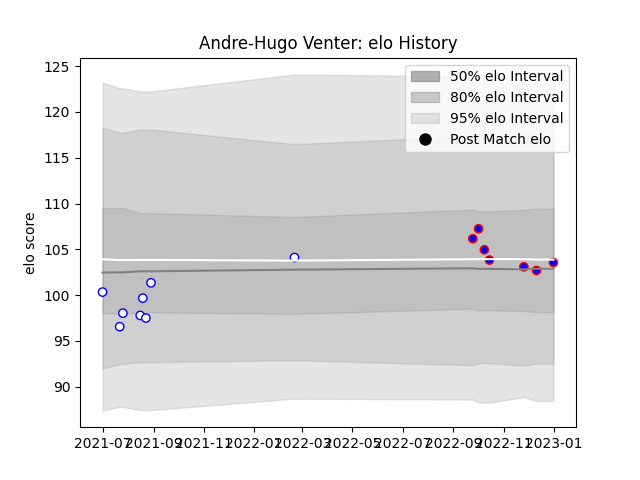

---  
layout: page  
title: Andre-Hugo Venter  
date: 2023-01-06 00:08:57.785315  
categories: player  
---
# Andre-Hugo Venter

## Positions: H

## Current elo: 104.0

## Current Percentile: 53.0

# Elo History

# Match History

| Team             |   Appearances |   Win Rate |
|:-----------------|--------------:|-----------:|
| Western Province |             8 |   0.5625   |
| Stormers         |             7 |   0.785714 |

| Opponent            |   Matches |   Win Rate |
|:--------------------|----------:|-----------:|
| Griquas             |         2 |       0    |
| Natal Sharks        |         2 |       1    |
| Pumas               |         2 |       0.75 |
| Clermont Auvergne   |         1 |       0    |
| Connacht            |         1 |       1    |
| Edinburgh           |         1 |       1    |
| Free State Cheetahs |         1 |       0    |
| Golden Lions        |         1 |       1    |
| Lions               |         1 |       1    |
| Ospreys             |         1 |       0.5  |
| Scarlets            |         1 |       1    |
| Zebre               |         1 |       1    |