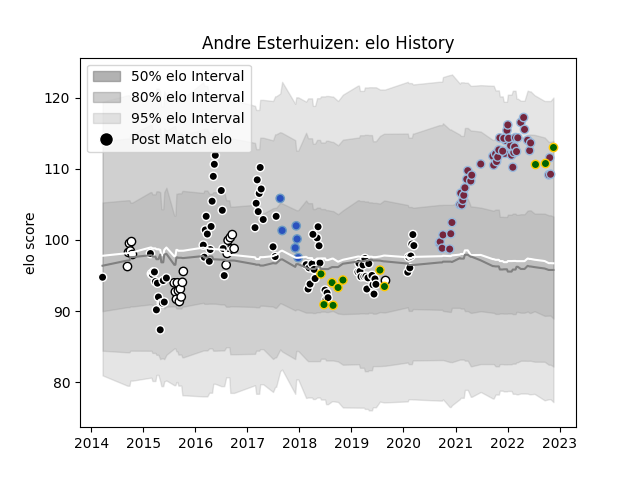

---  
layout: page  
title: Andre Esterhuizen  
date: 2023-03-17 17:22:14.829889  
categories: player  
---
# Andre Esterhuizen

## Positions: C

## Country: South Africa

## Current elo: 114.0

## Current Percentile: 90.0

# Elo History

# Match History

| Team                 |   Appearances |   Win Rate |
|:---------------------|--------------:|-----------:|
| Sharks               |            82 |   0.52439  |
| Harlequins           |            64 |   0.625    |
| Natal Sharks         |            26 |   0.576923 |
| Munakata Sanix Blues |            19 |   0.263158 |
| South Africa         |            11 |   0.545455 |

| Opponent                          |   Matches |   Win Rate |
|:----------------------------------|----------:|-----------:|
| Lions                             |        11 |   0.363636 |
| Bulls                             |        10 |   0.15     |
| Jaguares                          |         8 |   0.625    |
| Stormers                          |         8 |   0.625    |
| Gloucester Rugby                  |         7 |   0.857143 |
| London Irish                      |         6 |   0.666667 |
| Hurricanes                        |         6 |   0.166667 |
| Northampton Saints                |         5 |   0.6      |
| Bristol Rugby                     |         5 |   0.4      |
| Exeter Chiefs                     |         5 |   0.6      |
| Leicester Tigers                  |         5 |   0.6      |
| Sale Sharks                       |         5 |   0.4      |
| Golden Lions                      |         5 |   0.2      |
| New South Wales Waratahs          |         4 |   0.625    |
| Melbourne Rebels                  |         4 |   0.875    |
| Queensland Reds                   |         4 |   0.5      |
| Wasps                             |         4 |   0.75     |
| Free State Cheetahs               |         4 |   0.25     |
| Argentina                         |         4 |   0.75     |
| Highlanders                       |         4 |   0.75     |
| Eastern Province Kings            |         4 |   1        |
| Crusaders                         |         4 |   0.125    |
| Bath Rugby                        |         4 |   0.75     |
| Blue Bulls                        |         4 |   0.75     |
| Saracens                          |         3 |   0        |
| Sunwolves                         |         3 |   1        |
| Worcester Warriors                |         3 |   1        |
| Pumas                             |         3 |   0.666667 |
| Newcastle Falcons                 |         3 |   0.666667 |
| Blues                             |         3 |   0.666667 |
| Western Province                  |         3 |   0.333333 |
| Brumbies                          |         3 |   0.333333 |
| Chiefs                            |         3 |   0.666667 |
| Cheetahs                          |         3 |   1        |
| Southern Kings                    |         3 |   1        |
| Wales                             |         2 |   0        |
| Sharks                            |         2 |   0.5      |
| Coca-Cola Red Sparks              |         2 |   1        |
| Griquas                           |         2 |   1        |
| Hanazono Kintetsu Liners          |         2 |   0.5      |
| Racing 92                         |         2 |   0.5      |
| Castres Olympique                 |         2 |   1        |
| Montpellier Herault               |         2 |   0.5      |
| Toyota Industries Shuttles Aichi  |         2 |   0.5      |
| Australia                         |         2 |   1        |
| England                           |         2 |   0        |
| Western Force                     |         1 |   1        |
| Urayasu D-Rocks                   |         1 |   0        |
| Tokyo Sungoliath                  |         1 |   0        |
| Toyota Verblitz                   |         1 |   0        |
| Kubota Spears Funabashi Tokyo-Bay |         1 |   0        |
| Shizuoka Blue Revs                |         1 |   0        |
| Saitama Wild Knights              |         1 |   0        |
| NTT Docomo Red Hurricanes Osaka   |         1 |   0        |
| Mie Honda Heat                    |         1 |   0        |
| Kobelco Kobe Steelers             |         1 |   0        |
| Italy                             |         1 |   1        |
| Hino Red Dolphins                 |         1 |   1        |
| Green Rockets Tokatsu             |         1 |   0        |
| Cardiff Blues                     |         1 |   1        |
| Boland Cavaliers                  |         1 |   1        |
| Black Rams Tokyo                  |         1 |   0        |
| Yokohama Canon Eagles             |         1 |   0        |