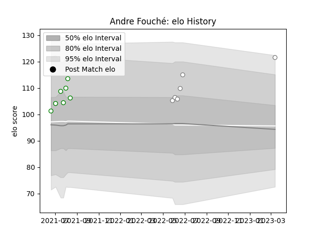

---  
layout: page  
title: Andre Fouché  
date: 2023-03-21 18:34:06.084038  
categories: player  
---
# Andre Fouché

Last updated: 2023-03-21
## Positions: N8, FL

## Current elo: 111.0

## Current Percentile: 92.0

# Elo History

# Match History

| Team     |   Appearances |   Win Rate |
|:---------|--------------:|-----------:|
| Leopards |             7 |   0.857143 |
| Pumas    |             7 |   0.714286 |

| Opponent               |   Matches |   Win Rate |
|:-----------------------|----------:|-----------:|
| Blue Bulls             |         2 |        0.5 |
| Boland Cavaliers       |         2 |        1   |
| Free State Cheetahs    |         2 |        1   |
| Griffons               |         2 |        1   |
| Griquas                |         2 |        0.5 |
| Border Bulldogs        |         1 |        1   |
| Eastern Province Kings |         1 |        1   |
| Golden Lions           |         1 |        1   |
| Valke                  |         1 |        0   |