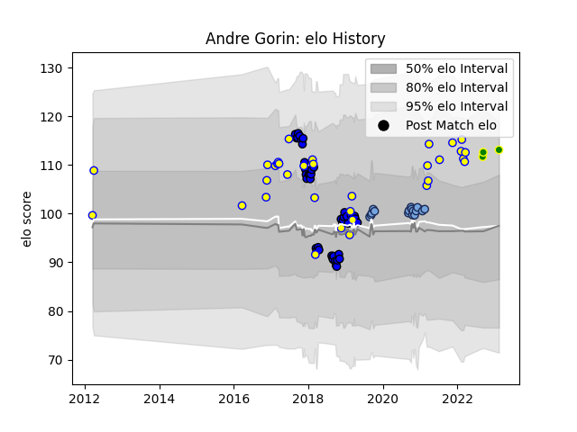

---  
layout: page  
title: Andre Gorin  
date: 2023-02-15 22:13:06.265463  
categories: player  
---
# Andre Gorin

## Positions: N8, FL

## Country: Romania

## Current elo: 113.0

## Current Percentile: 81.0

# Elo History

# Match History

| Team                |   Appearances |   Win Rate |
|:--------------------|--------------:|-----------:|
| Massy               |            45 |   0.322222 |
| Romania             |            33 |   0.636364 |
| Bayonne             |            17 |   0.529412 |
| Carqueiranne-Hyères |             3 |   0        |

| Opponent                 |   Matches |   Win Rate |
|:-------------------------|----------:|-----------:|
| Russia                   |         5 |   0.8      |
| Spain                    |         5 |   0.2      |
| Georgia                  |         5 |   0.2      |
| Colomiers                |         4 |   0.5      |
| Bayonne                  |         4 |   0        |
| Nevers                   |         4 |   0.25     |
| Vannes                   |         3 |   0.333333 |
| Soyaux-Angouleme         |         3 |   0.5      |
| Montauban                |         3 |   0        |
| La Rochelle              |         3 |   0.333333 |
| Germany                  |         3 |   0.666667 |
| Portugal                 |         3 |   1        |
| Aurillac                 |         3 |   0.333333 |
| Brive                    |         3 |   0.666667 |
| Beziers                  |         3 |   0        |
| Biarritz Olympique       |         3 |   0.666667 |
| Carcassonne              |         2 |   0.5      |
| Stade Francais Paris     |         2 |   0.5      |
| Perpignan                |         2 |   0.5      |
| Belgium                  |         2 |   1        |
| Netherlands              |         2 |   1        |
| Dax                      |         2 |   0.5      |
| Grenoble                 |         2 |   0.5      |
| US Bressane              |         2 |   0        |
| Toulon                   |         1 |   1        |
| United States of America |         1 |   1        |
| Uruguay                  |         1 |   1        |
| Suresnes                 |         1 |   0        |
| Samoa                    |         1 |   1        |
| Ukraine                  |         1 |   1        |
| Racing 92                |         1 |   1        |
| Tarbes                   |         1 |   0        |
| Stade Toulousain         |         1 |   0        |
| Agen                     |         1 |   1        |
| Provence Rugby           |         1 |   1        |
| Oyonnax                  |         1 |   0        |
| Narbonne                 |         1 |   0        |
| Montpellier Herault      |         1 |   1        |
| Argentina                |         1 |   0        |
| Lyon                     |         1 |   0        |
| Leicester Tigers         |         1 |   0        |
| Japan                    |         1 |   0        |
| Clermont Auvergne        |         1 |   1        |
| Castres Olympique        |         1 |   1        |
| Canada                   |         1 |   1        |
| Brazil                   |         1 |   1        |
| Bourgoin-Jallieu         |         1 |   0        |
| Bordeaux Begles          |         1 |   0        |
| Mont-de-Marsan           |         1 |   0        |