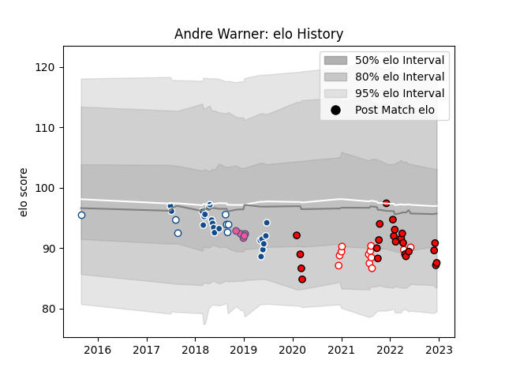

---  
layout: page  
title: Andre Warner  
date: 2023-02-02 18:47:27.302548  
categories: player  
---
# Andre Warner

## Positions: SH

## Current elo: 91.0

## Current Percentile: 42.0

# Elo History

# Match History

| Team                 |   Appearances |   Win Rate |
|:---------------------|--------------:|-----------:|
| Lions                |            27 |   0.388889 |
| Blue Bulls           |            21 |   0.619048 |
| Bulls                |            20 |   0.425    |
| Golden Lions         |            13 |   0.423077 |
| Stade Francais Paris |             5 |   0.6      |

| Opponent                 |   Matches |   Win Rate |
|:-------------------------|----------:|-----------:|
| Griquas                  |         9 |   0.666667 |
| Pumas                    |         6 |   0.666667 |
| Sharks                   |         6 |   0.5      |
| Natal Sharks             |         5 |   0.4      |
| Dragons                  |         4 |   0.875    |
| Free State Cheetahs      |         4 |   0.625    |
| Golden Lions             |         3 |   0.666667 |
| Blue Bulls               |         3 |   0        |
| Stormers                 |         3 |   0.333333 |
| Western Province         |         3 |   0.333333 |
| Melbourne Rebels         |         3 |   0.666667 |
| Ospreys                  |         2 |   0.5      |
| Scarlets                 |         2 |   0.5      |
| Connacht                 |         2 |   0        |
| New South Wales Waratahs |         2 |   0.5      |
| Bulls                    |         2 |   0        |
| Brumbies                 |         2 |   0        |
| Hurricanes               |         2 |   0.5      |
| Jaguares                 |         2 |   0        |
| Lions                    |         2 |   0.5      |
| Blues                    |         2 |   0.25     |
| Benetton Treviso         |         1 |   1        |
| Southern Kings           |         1 |   0        |
| Stade Francais Paris     |         1 |   1        |
| Sunwolves                |         1 |   0        |
| Ulster                   |         1 |   0        |
| Queensland Reds          |         1 |   0        |
| Lyon                     |         1 |   0        |
| Perpignan                |         1 |   1        |
| Pau                      |         1 |   1        |
| Munster                  |         1 |   0        |
| Grenoble                 |         1 |   1        |
| Glasgow Warriors         |         1 |   0        |
| Edinburgh                |         1 |   1        |
| Eastern Province Kings   |         1 |   1        |
| Crusaders                |         1 |   0        |
| Chiefs                   |         1 |   0        |
| Zebre                    |         1 |   1        |