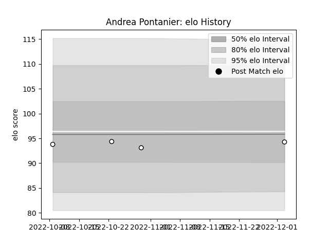

---  
layout: page  
title: Andrea Pontanier  
date: 2023-01-15 11:43:33.840540  
categories: player  
---
# Andrea Pontanier

## Positions: P

## Current elo: 86.0

## Current Percentile: 21.0

# Elo History

# Match History

| Team                       |   Appearances |   Win Rate |
|:---------------------------|--------------:|-----------:|
| Valence Romans Drome Rugby |             8 |     0.4375 |

| Opponent         |   Matches |   Win Rate |
|:-----------------|----------:|-----------:|
| Blagnac          |         2 |        0   |
| Suresnes         |         2 |        1   |
| Bourgoin-Jallieu |         1 |        0.5 |
| Chambery         |         1 |        0   |
| Narbonne         |         1 |        1   |
| US Bressane      |         1 |        0   |