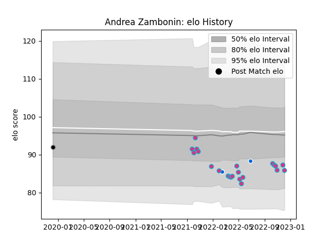

---  
layout: page  
title: Andrea Zambonin  
date: 2022-12-09 13:07:44.326457  
categories: player  
---
# Andrea Zambonin

## Positions: L

## Country: Italy

## Current elo: 86.0

## Current Percentile: 19.0

# Elo History

# Match History

| Team      |   Appearances |   Win Rate |
|:----------|--------------:|-----------:|
| Zebre     |            22 |  0.0454545 |
| Italy     |             2 |  0.5       |
| Calvisano |             1 |  0         |

| Opponent         |   Matches |   Win Rate |
|:-----------------|----------:|-----------:|
| Edinburgh        |         3 |        0   |
| Glasgow Warriors |         3 |        0   |
| Benetton Treviso |         2 |        0   |
| Dragons          |         2 |        0.5 |
| Scarlets         |         2 |        0   |
| Stormers         |         2 |        0   |
| Ulster           |         2 |        0   |
| Cardiff Blues    |         1 |        0   |
| Connacht         |         1 |        0   |
| England          |         1 |        0   |
| Leicester Tigers |         1 |        0   |
| Leinster         |         1 |        0   |
| Lions            |         1 |        0   |
| Munster          |         1 |        0   |
| Portugal         |         1 |        1   |
| Sharks           |         1 |        0   |