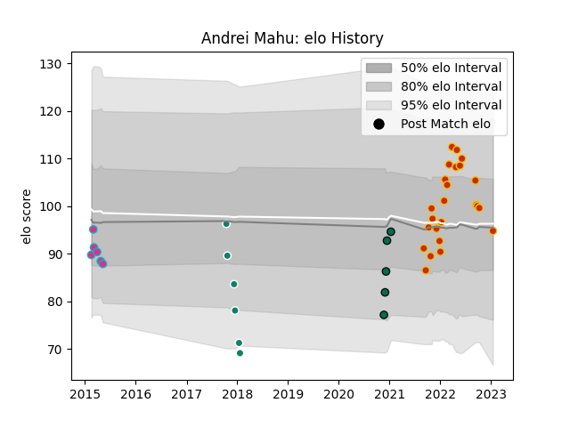

---  
layout: page  
title: Andrei Mahu  
date: 2023-02-02 18:39:16.770195  
categories: player  
---
# Andrei Mahu

## Positions: L

## Current elo: 101.0

## Current Percentile: 64.0

# Elo History

# Match History

| Team         |   Appearances |   Win Rate |
|:-------------|--------------:|-----------:|
| Perpignan    |            26 |   0.307692 |
| Krasny Yar   |             6 |   0.166667 |
| Zebre        |             6 |   0.166667 |
| London Irish |             5 |   0.5      |

| Opponent             |   Matches |   Win Rate |
|:---------------------|----------:|-----------:|
| Stade Francais Paris |         5 |   0.4      |
| Brive                |         3 |   0.333333 |
| Edinburgh            |         3 |   0        |
| Glasgow Warriors     |         3 |   0        |
| La Rochelle          |         3 |   0.333333 |
| Bordeaux Begles      |         2 |   0.5      |
| Toulon               |         2 |   0.5      |
| Castres Olympique    |         2 |   0        |
| Stade Toulousain     |         2 |   0.5      |
| Racing 92            |         2 |   0.5      |
| London Irish         |         2 |   0        |
| Lyon                 |         2 |   0        |
| Agen                 |         1 |   1        |
| Ospreys              |         1 |   0        |
| Sale Sharks          |         1 |   0        |
| Pau                  |         1 |   0        |
| Leicester Tigers     |         1 |   1        |
| Montpellier Herault  |         1 |   0        |
| Biarritz Olympique   |         1 |   1        |
| Harlequins           |         1 |   0.5      |
| Dragons              |         1 |   1        |
| Connacht             |         1 |   0        |
| Bristol Rugby        |         1 |   0        |
| Worcester Warriors   |         1 |   0        |