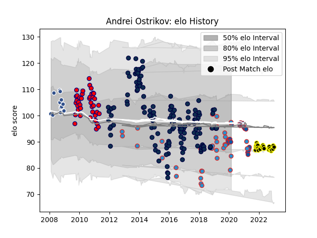

---  
layout: page  
title: Andrei Ostrikov  
date: 2023-03-21 18:44:25.024148  
categories: player  
---
# Andrei Ostrikov

Last updated: 2023-03-21
## Positions: L

## Country: Russia

## Current elo: 86.0

## Current Percentile: 21.0

# Elo History

# Match History

| Team           |   Appearances |   Win Rate |
|:---------------|--------------:|-----------:|
| Sale Sharks    |           143 |   0.503497 |
| Aurillac       |            40 |   0.5125   |
| Russia         |            34 |   0.397059 |
| Mont-de-Marsan |            26 |   0.615385 |
| Grenoble       |            25 |   0.48     |
| Agen           |            12 |   0.416667 |

| Opponent                   |   Matches |   Win Rate |
|:---------------------------|----------:|-----------:|
| Bath Rugby                 |        12 |   0.625    |
| Wasps                      |        12 |   0.666667 |
| Harlequins                 |        11 |   0.363636 |
| Saracens                   |        11 |   0.136364 |
| Newcastle Falcons          |        11 |   0.5      |
| Worcester Warriors         |        10 |   0.95     |
| Gloucester Rugby           |        10 |   0.4      |
| Leicester Tigers           |        10 |   0.3      |
| Exeter Chiefs              |         9 |   0.333333 |
| Northampton Saints         |         9 |   0.444444 |
| Oyonnax                    |         9 |   0.555556 |
| Grenoble                   |         8 |   0.375    |
| Colomiers                  |         7 |   0.714286 |
| Georgia                    |         7 |   0        |
| London Irish               |         7 |   0.642857 |
| Romania                    |         7 |   0.5      |
| Biarritz Olympique         |         7 |   0.5      |
| Pau                        |         6 |   0.5      |
| Portugal                   |         6 |   0.833333 |
| Provence Rugby             |         6 |   0.666667 |
| Spain                      |         6 |   0.5      |
| Aurillac                   |         5 |   1        |
| Auch                       |         5 |   0.6      |
| Rouen                      |         4 |   0.5      |
| Narbonne                   |         4 |   0.5      |
| Perpignan                  |         4 |   0.25     |
| Agen                       |         4 |   0.75     |
| Lyon                       |         4 |   0.5      |
| Bordeaux Begles            |         4 |   0.5      |
| Beziers                    |         4 |   0.25     |
| Montauban                  |         3 |   0.166667 |
| Dax                        |         3 |   0.666667 |
| Scarlets                   |         3 |   0.666667 |
| Tarbes                     |         3 |   0.333333 |
| Carcassonne                |         3 |   0.666667 |
| Mont-de-Marsan             |         3 |   0.333333 |
| Albi                       |         3 |   0.5      |
| Castres Olympique          |         2 |   1        |
| US Bressane                |         2 |   1        |
| Stade Toulousain           |         2 |   0.25     |
| Valence Romans Drome Rugby |         2 |   1        |
| Vannes                     |         2 |   0.5      |
| Bayonne                    |         2 |   1        |
| Bristol Rugby              |         2 |   0.5      |
| Toulon                     |         2 |   0        |
| Japan                      |         2 |   0        |
| Dragons                    |         2 |   0.5      |
| Nevers                     |         2 |   0.5      |
| Munster                    |         2 |   0        |
| Lannemezan                 |         1 |   1        |
| Namibia                    |         1 |   1        |
| Italy                      |         1 |   0        |
| Ireland                    |         1 |   0        |
| London Welsh               |         1 |   1        |
| Massy                      |         1 |   0        |
| Montpellier Herault        |         1 |   0        |
| Soyaux-Angouleme           |         1 |   0        |
| Germany                    |         1 |   1        |
| Clermont Auvergne          |         1 |   0        |
| Scotland                   |         1 |   0        |
| Samoa                      |         1 |   0        |
| Saint-Etienne              |         1 |   1        |
| Connacht                   |         1 |   0        |
| Brive                      |         1 |   0        |
| Cardiff Blues              |         1 |   1        |