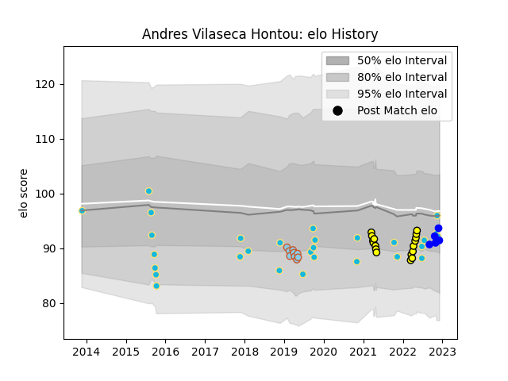

---  
layout: page  
title: Andres Vilaseca Hontou  
date: 2023-01-13 11:36:04.819889  
categories: player  
---
# Andres Vilaseca Hontou

## Positions: C

## Country: Uruguay

## Current elo: 103.0

## Current Percentile: 70.0

# Elo History

# Match History

| Team               |   Appearances |   Win Rate |
|:-------------------|--------------:|-----------:|
| Uruguay            |            29 |   0.413793 |
| Penarol Rugby      |            18 |   0.777778 |
| Austin Elite Rugby |             9 |   0        |
| Vannes             |             7 |   0.5      |

| Opponent                 |   Matches |   Win Rate |
|:-------------------------|----------:|-----------:|
| Olimpia Lions            |         4 |   0.75     |
| Jaguares XV              |         4 |   0.5      |
| Romania                  |         4 |   0.75     |
| Cafeteros Pro            |         4 |   1        |
| Japan                    |         4 |   0        |
| Spain                    |         4 |   0.5      |
| Cobras                   |         3 |   1        |
| Fiji                     |         3 |   0.333333 |
| Selknam                  |         3 |   0.666667 |
| Namibia                  |         2 |   1        |
| NOLA Gold                |         2 |   0        |
| San Diego Legion         |         2 |   0        |
| Massy                    |         2 |   0.5      |
| Wales                    |         2 |   0        |
| Australia                |         2 |   0        |
| Georgia                  |         2 |   0        |
| R.U. New York            |         1 |   0        |
| Tonga                    |         1 |   0        |
| Toronto Arrows           |         1 |   0        |
| United States of America |         1 |   1        |
| Utah Warriors            |         1 |   0        |
| Agen                     |         1 |   0        |
| Provence Rugby           |         1 |   1        |
| Montauban                |         1 |   0.5      |
| Argentina                |         1 |   1        |
| Houston SaberCats        |         1 |   0        |
| Glendale Raptors         |         1 |   0        |
| England                  |         1 |   0        |
| Canada                   |         1 |   1        |
| Brazil                   |         1 |   1        |
| Biarritz Olympique       |         1 |   1        |
| Mont-de-Marsan           |         1 |   0        |