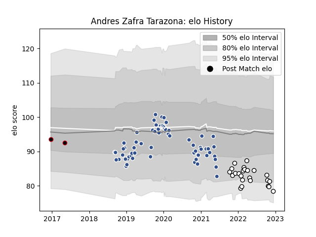

---  
layout: page  
title: Andres Zafra Tarazona  
date: 2022-12-18 16:32:43.472542  
categories: player  
---
# Andres Zafra Tarazona

## Positions: L, FL

## Current elo: 78.0

## Current Percentile: 8.0

# Elo History

# Match History

| Team   |   Appearances |   Win Rate |
|:-------|--------------:|-----------:|
| Agen   |            62 |   0.201613 |
| Brive  |            24 |   0.270833 |
| Lyon   |             2 |   0        |

| Opponent             |   Matches |   Win Rate |
|:---------------------|----------:|-----------:|
| Toulon               |         8 |   0.25     |
| Racing 92            |         8 |   0.1875   |
| Bordeaux Begles      |         7 |   0.142857 |
| Castres Olympique    |         7 |   0.285714 |
| La Rochelle          |         6 |   0.166667 |
| Lyon                 |         6 |   0        |
| Clermont Auvergne    |         6 |   0.166667 |
| Montpellier Herault  |         6 |   0.25     |
| Stade Toulousain     |         5 |   0        |
| Stade Francais Paris |         5 |   0.4      |
| Bayonne              |         4 |   0.25     |
| Brive                |         4 |   0.5      |
| Grenoble             |         3 |   0.333333 |
| Edinburgh            |         3 |   0        |
| Benetton Treviso     |         2 |   0.5      |
| Pau                  |         2 |   0        |
| Perpignan            |         2 |   0.5      |
| Newcastle Falcons    |         1 |   0        |
| Cardiff Blues        |         1 |   0        |
| Biarritz Olympique   |         1 |   1        |
| Wasps                |         1 |   0        |