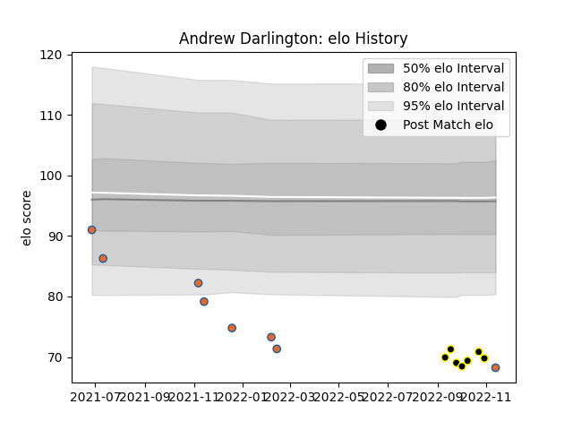

---  
layout: page  
title: Andrew Darlington  
date: 2023-02-24 02:23:09.641347  
categories: player  
---
# Andrew Darlington

## Positions: P, H

## Country: Netherlands

## Current elo: 51.0

## Current Percentile: 3.0

# Elo History

# Match History

| Team        |   Appearances |   Win Rate |
|:------------|--------------:|-----------:|
| Netherlands |            12 |   0.166667 |
| Caldy       |            10 |   0.2      |

| Opponent         |   Matches |   Win Rate |
|:-----------------|----------:|-----------:|
| Georgia          |         4 |          0 |
| Spain            |         2 |          0 |
| Germany          |         2 |          1 |
| London Scottish  |         1 |          0 |
| Russia           |         1 |          0 |
| Romania          |         1 |          0 |
| Richmond         |         1 |          1 |
| Portugal         |         1 |          0 |
| Nottingham       |         1 |          0 |
| Ampthill         |         1 |          0 |
| Jersey           |         1 |          0 |
| Bedford          |         1 |          0 |
| Doncaster        |         1 |          0 |
| Coventry         |         1 |          0 |
| Cornish Pirates  |         1 |          1 |
| Canada           |         1 |          0 |
| Hartpury College |         1 |          0 |