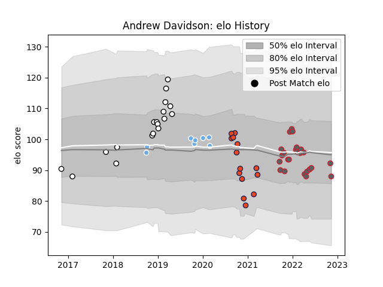

---  
layout: page  
title: Andrew Davidson  
date: 2023-03-21 18:25:58.783991  
categories: player  
---
# Andrew Davidson

Last updated: 2023-03-21
## Positions: L

## Current elo: 88.0

## Current Percentile: 30.0

# Elo History

# Match History

| Team              |   Appearances |   Win Rate |
|:------------------|--------------:|-----------:|
| Gloucester Rugby  |            24 |   0.5      |
| Newcastle Falcons |            18 |   0.444444 |
| Edinburgh         |            14 |   0.285714 |
| Glasgow Warriors  |             8 |   0.625    |

| Opponent           |   Matches |   Win Rate |
|:-------------------|----------:|-----------:|
| Bath Rugby         |         6 |   0.666667 |
| Northampton Saints |         5 |   0.4      |
| Wasps              |         4 |   0.75     |
| Sale Sharks        |         4 |   0.5      |
| Dragons            |         4 |   0.75     |
| Harlequins         |         4 |   0        |
| Bristol Rugby      |         3 |   0.333333 |
| Exeter Chiefs      |         3 |   0        |
| Newcastle Falcons  |         3 |   0.666667 |
| Leicester Tigers   |         2 |   0        |
| Worcester Warriors |         2 |   1        |
| Ulster             |         2 |   0        |
| Munster            |         2 |   0        |
| Leinster           |         2 |   0        |
| Gloucester Rugby   |         2 |   0.5      |
| Glasgow Warriors   |         2 |   1        |
| Connacht           |         2 |   0.5      |
| Benetton Treviso   |         1 |   1        |
| London Irish       |         1 |   1        |
| Lyon               |         1 |   0        |
| La Rochelle        |         1 |   0        |
| Ospreys            |         1 |   0        |
| Saracens           |         1 |   1        |
| Scarlets           |         1 |   1        |
| Southern Kings     |         1 |   1        |
| Cheetahs           |         1 |   0        |
| Cardiff Blues      |         1 |   0        |
| Bordeaux Begles    |         1 |   0        |
| Zebre              |         1 |   1        |