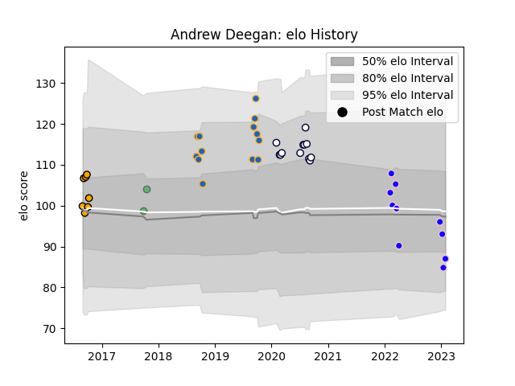

---  
layout: page  
title: Andrew Deegan  
date: 2022-12-28 12:54:12.848297  
categories: player  
---
# Andrew Deegan

## Positions: FH

## Current elo: 98.0

## Current Percentile: 51.0

# Elo History

# Match History

| Team               |   Appearances |   Win Rate |
|:-------------------|--------------:|-----------:|
| Western Force      |            13 |   0.769231 |
| Melbourne Rebels   |            12 |   0.5      |
| Kurita Water Gush  |             7 |   0.142857 |
| NSW Country Eagles |             7 |   0.857143 |
| Connacht           |             2 |   0.5      |

| Opponent                         |   Matches |   Win Rate |
|:---------------------------------|----------:|-----------:|
| Brisbane City                    |         3 |   1        |
| Melbourne Rising                 |         3 |   1        |
| Canberra Vikings                 |         3 |   0.666667 |
| Queensland Country               |         3 |   0.666667 |
| Queensland Reds                  |         2 |   0        |
| New South Wales Waratahs         |         2 |   0.5      |
| Brumbies                         |         2 |   0.5      |
| Munakata Sanix Blues             |         2 |   0        |
| NSW Country Eagles               |         2 |   0.5      |
| Fijian Drua                      |         2 |   0.5      |
| Chugoku Red Regulions            |         2 |   0.5      |
| Western Force                    |         2 |   1        |
| Lions                            |         1 |   1        |
| Kyuden Voltex                    |         1 |   0        |
| Highlanders                      |         1 |   1        |
| Greater Sydney Rams              |         1 |   1        |
| North Harbour Rays               |         1 |   1        |
| Oyonnax                          |         1 |   1        |
| Perth Spirit                     |         1 |   1        |
| Cardiff Blues                    |         1 |   0        |
| Sharks                           |         1 |   0        |
| Shimizu Blue Sharks              |         1 |   0        |
| Sunwolves                        |         1 |   0        |
| Sydney Rays                      |         1 |   1        |
| Toyota Industries Shuttles Aichi |         1 |   0        |