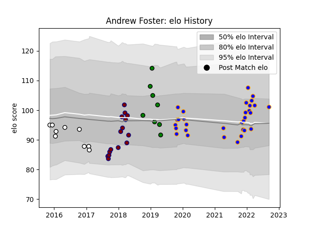

---  
layout: page  
title: Andrew Foster  
date: 2023-03-21 18:12:29.363580  
categories: player  
---
# Andrew Foster

Last updated: 2023-03-21
## Positions: P

## Current elo: 101.0

## Current Percentile: 68.0

# Elo History

# Match History

| Team               |   Appearances |   Win Rate |
|:-------------------|--------------:|-----------:|
| Doncaster          |            31 |   0.645161 |
| Rotherham Titans   |            15 |   0.133333 |
| Newcastle Falcons  |             9 |   0.333333 |
| Yorkshire Carnegie |             8 |   0.625    |

| Opponent            |   Matches |   Win Rate |
|:--------------------|----------:|-----------:|
| Hartpury College    |         6 |   0.666667 |
| Jersey              |         6 |   0.5      |
| Bedford             |         6 |   0.333333 |
| Cornish Pirates     |         6 |   0.333333 |
| Ealing Trailfinders |         6 |   0.333333 |
| Nottingham          |         5 |   0.6      |
| Richmond            |         4 |   0.75     |
| Coventry            |         3 |   0.333333 |
| Doncaster           |         3 |   0.666667 |
| London Scottish     |         3 |   0.666667 |
| Saracens            |         2 |   0        |
| Ampthill            |         2 |   1        |
| Brive               |         2 |   0.5      |
| Bath Rugby          |         1 |   1        |
| Dragons             |         1 |   1        |
| Lyon                |         1 |   0        |
| Newcastle Falcons   |         1 |   0        |
| Connacht            |         1 |   0        |
| Ospreys             |         1 |   0        |
| RC Enisei           |         1 |   0        |
| Bristol Rugby       |         1 |   0        |
| Yorkshire Carnegie  |         1 |   1        |