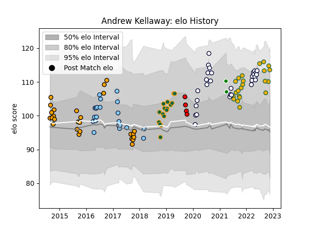

---  
layout: page  
title: Andrew Kellaway  
date: 2022-11-22 11:46:46.681036  
categories: player  
---
# Andrew Kellaway

## Positions: W, FB

## Country: Australia

## Current elo: 114.0

## Current Percentile: 92.0

# Elo History

# Match History

| Team                     |   Appearances |   Win Rate |
|:-------------------------|--------------:|-----------:|
| Melbourne Rebels         |            29 |   0.362069 |
| NSW Country Eagles       |            26 |   0.653846 |
| Australia                |            22 |   0.454545 |
| New South Wales Waratahs |            21 |   0.452381 |
| Northampton Saints       |            16 |   0.5      |
| Counties Manukau         |             4 |   0        |
| Green Rockets Tokatsu    |             2 |   0        |

| Opponent                 |   Matches |   Win Rate |
|:-------------------------|----------:|-----------:|
| Brumbies                 |         6 |   0.166667 |
| New Zealand              |         5 |   0        |
| Western Force            |         4 |   1        |
| South Africa             |         4 |   0.75     |
| Queensland Reds          |         4 |   0.125    |
| Canberra Vikings         |         4 |   0.75     |
| New South Wales Waratahs |         4 |   0.5      |
| Hurricanes               |         4 |   0        |
| Crusaders                |         4 |   0        |
| Greater Sydney Rams      |         4 |   0.75     |
| France                   |         3 |   0.333333 |
| Sharks                   |         3 |   0.166667 |
| Queensland Country       |         3 |   0.333333 |
| Perth Spirit             |         3 |   1        |
| Melbourne Rising         |         3 |   0.333333 |
| Highlanders              |         3 |   0.666667 |
| Argentina                |         3 |   1        |
| Brisbane City            |         3 |   0.333333 |
| Chiefs                   |         3 |   0.333333 |
| Fijian Drua              |         2 |   0.5      |
| Melbourne Rebels         |         2 |   0.5      |
| Wasps                    |         2 |   0.5      |
| Sydney Stars             |         2 |   1        |
| Sunwolves                |         2 |   0.5      |
| Stormers                 |         2 |   1        |
| Scotland                 |         2 |   0.5      |
| Blues                    |         2 |   0        |
| England                  |         2 |   0.5      |
| Newcastle Falcons        |         2 |   0.5      |
| North Harbour Rays       |         2 |   1        |
| Lions                    |         2 |   0.5      |
| Leicester Tigers         |         2 |   0.5      |
| Dragons                  |         2 |   1        |
| Clermont Auvergne        |         2 |   0        |
| Black Rams Tokyo         |         1 |   0        |
| Harlequins               |         1 |   1        |
| Wales                    |         1 |   0        |
| Timisoara Saracens       |         1 |   1        |
| Hawke's Bay              |         1 |   0        |
| Sydney Rays              |         1 |   1        |
| Southland                |         1 |   0        |
| Bath Rugby               |         1 |   0        |
| Manawatu                 |         1 |   0        |
| Moana Pasifika           |         1 |   1        |
| Saracens                 |         1 |   0        |
| Sale Sharks              |         1 |   0        |
| Saitama Wild Knights     |         1 |   0        |
| Jaguares                 |         1 |   0        |
| Japan                    |         1 |   1        |
| Bristol Rugby            |         1 |   1        |
| Auckland                 |         1 |   0        |
| Bulls                    |         1 |   1        |
| Cheetahs                 |         1 |   1        |
| Ireland                  |         1 |   0        |