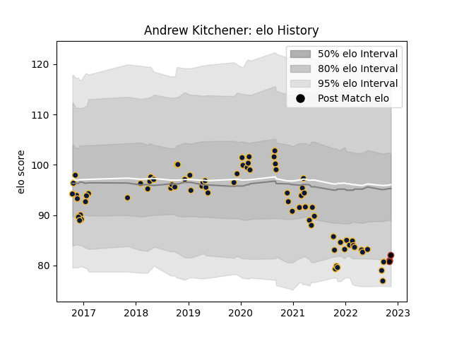

---  
layout: page  
title: Andrew Kitchener  
date: 2022-11-15 23:35:34.432017  
categories: player  
---
# Andrew Kitchener

## Positions: L

## Current elo: 79.0

## Current Percentile: 6.0

# Elo History

# Match History

| Team               |   Appearances |   Win Rate |
|:-------------------|--------------:|-----------:|
| Worcester Warriors |            74 |   0.290541 |
| Saracens           |             3 |   1        |

| Opponent             |   Matches |   Win Rate |
|:---------------------|----------:|-----------:|
| Wasps                |         9 |   0        |
| Northampton Saints   |         9 |   0.111111 |
| Bristol Rugby        |         8 |   0.375    |
| Sale Sharks          |         7 |   0.428571 |
| Exeter Chiefs        |         6 |   0        |
| RC Enisei            |         4 |   0.75     |
| Bath Rugby           |         4 |   0.25     |
| Dragons              |         4 |   0.5      |
| London Irish         |         4 |   0.25     |
| Leicester Tigers     |         3 |   0        |
| Newcastle Falcons    |         3 |   0.833333 |
| Saracens             |         3 |   0.333333 |
| Gloucester Rugby     |         2 |   0.5      |
| Harlequins           |         2 |   0.5      |
| Ospreys              |         2 |   1        |
| Brive                |         2 |   0        |
| Stade Francais Paris |         2 |   1        |
| Castres Olympique    |         1 |   0        |
| Pau                  |         1 |   0        |
| Cardiff Blues        |         1 |   1        |