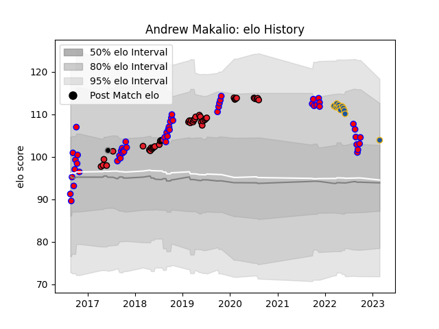

---  
layout: page  
title: Andrew Makalio  
date: 2023-03-17 17:22:35.552673  
categories: player  
---
# Andrew Makalio

## Positions: H

## Country: Provincial Union XV

## Current elo: 103.0

## Current Percentile: 80.0

# Elo History

# Match History

| Team                |   Appearances |   Win Rate |
|:--------------------|--------------:|-----------:|
| Tasman              |            52 |   0.663462 |
| Crusaders           |            43 |   0.872093 |
| Highlanders         |            13 |   0.230769 |
| Provincial Union XV |             1 |   0        |

| Opponent                 |   Matches |   Win Rate |
|:-------------------------|----------:|-----------:|
| Blues                    |        10 |   0.6      |
| Canterbury               |         8 |   0.125    |
| Hurricanes               |         8 |   0.625    |
| Hawke's Bay              |         6 |   0.666667 |
| Highlanders              |         6 |   1        |
| Auckland                 |         5 |   0.8      |
| Waikato                  |         5 |   0.4      |
| Taranaki                 |         5 |   0.8      |
| Chiefs                   |         5 |   0.6      |
| Southland                |         5 |   1        |
| Melbourne Rebels         |         4 |   0.75     |
| North Harbour            |         4 |   0.625    |
| New South Wales Waratahs |         4 |   0.5      |
| Wellington               |         4 |   0.75     |
| Otago                    |         3 |   0.666667 |
| Northland                |         3 |   1        |
| Brumbies                 |         3 |   0.666667 |
| Sunwolves                |         2 |   1        |
| Stormers                 |         2 |   0.75     |
| Manawatu                 |         2 |   1        |
| Crusaders                |         2 |   0        |
| Counties Manukau         |         2 |   1        |
| Bulls                    |         2 |   1        |
| Moana Pasifika           |         1 |   1        |
| Lions                    |         1 |   1        |
| Jaguares                 |         1 |   1        |
| Queensland Reds          |         1 |   1        |
| Sharks                   |         1 |   1        |
| Fijian Drua              |         1 |   1        |
| Cheetahs                 |         1 |   1        |
| British and Irish Lions  |         1 |   0        |
| Western Force            |         1 |   1        |