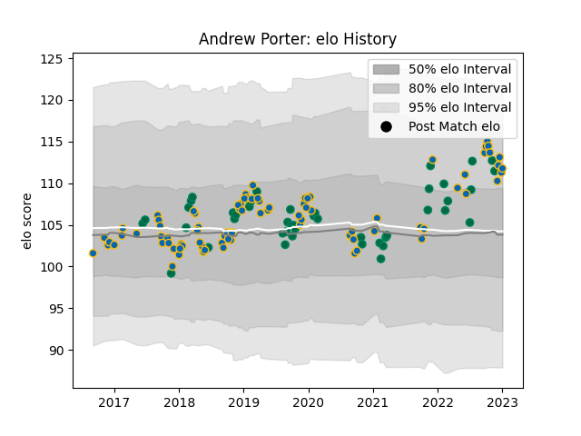

---  
layout: page  
title: Andrew Porter  
date: 2023-01-06 00:16:26.138428  
categories: player  
---
# Andrew Porter

## Positions: P

## Country: Ireland

## Current elo: 112.0

## Current Percentile: 79.0

# Elo History

# Match History

| Team     |   Appearances |   Win Rate |
|:---------|--------------:|-----------:|
| Leinster |            85 |   0.841176 |
| Ireland  |            44 |   0.75     |

| Opponent                 |   Matches |   Win Rate |
|:-------------------------|----------:|-----------:|
| Ulster                   |        11 |   0.909091 |
| Munster                  |         9 |   1        |
| Benetton Treviso         |         9 |   0.833333 |
| Connacht                 |         8 |   0.875    |
| Wales                    |         7 |   0.714286 |
| Dragons                  |         7 |   1        |
| New Zealand              |         6 |   0.666667 |
| Italy                    |         6 |   1        |
| England                  |         5 |   0.4      |
| Scarlets                 |         5 |   0.6      |
| Scotland                 |         5 |   1        |
| Glasgow Warriors         |         4 |   0.75     |
| Edinburgh                |         3 |   0.666667 |
| Japan                    |         3 |   0.666667 |
| France                   |         3 |   0        |
| Saracens                 |         2 |   0.5      |
| Argentina                |         2 |   1        |
| Sharks                   |         2 |   0.5      |
| Racing 92                |         2 |   1        |
| Stade Toulousain         |         2 |   0.5      |
| Wasps                    |         2 |   1        |
| Southern Kings           |         2 |   1        |
| Zebre                    |         2 |   1        |
| Northampton Saints       |         2 |   1        |
| Australia                |         2 |   1        |
| Lyon                     |         2 |   1        |
| Cardiff Blues            |         2 |   1        |
| Bulls                    |         2 |   0.5      |
| Bath Rugby               |         2 |   1        |
| Ospreys                  |         1 |   0        |
| Russia                   |         1 |   1        |
| Samoa                    |         1 |   1        |
| Gloucester Rugby         |         1 |   1        |
| Fiji                     |         1 |   1        |
| South Africa             |         1 |   1        |
| Exeter Chiefs            |         1 |   1        |
| Cheetahs                 |         1 |   0        |
| United States of America |         1 |   1        |
| Montpellier Herault      |         1 |   1        |