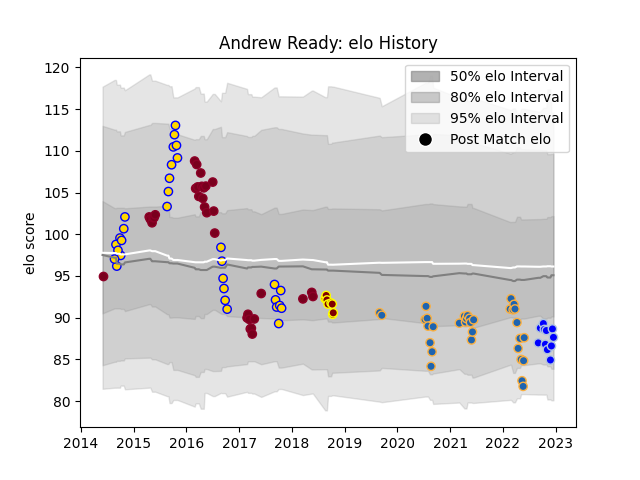

---  
layout: page  
title: Andrew Ready  
date: 2022-12-14 11:18:06.852518  
categories: player  
---
# Andrew Ready

## Positions: H

## Current elo: 89.0

## Current Percentile: 13.0

# Elo History

# Match History

| Team            |   Appearances |   Win Rate |
|:----------------|--------------:|-----------:|
| Queensland Reds |            33 |   0.318182 |
| Western Force   |            33 |   0.30303  |
| Brisbane City   |            31 |   0.709677 |
| Colomiers       |            10 |   0.6      |
| Southland       |             8 |   0        |

| Opponent                 |   Matches |   Win Rate |
|:-------------------------|----------:|-----------:|
| New South Wales Waratahs |         8 |   0.25     |
| Melbourne Rebels         |         8 |   0.375    |
| Brumbies                 |         6 |   0        |
| Hurricanes               |         6 |   0.166667 |
| Crusaders                |         5 |   0        |
| Queensland Country       |         5 |   0.8      |
| Melbourne Rising         |         5 |   0.6      |
| Highlanders              |         5 |   0.4      |
| Perth Spirit             |         4 |   0.75     |
| NSW Country Eagles       |         4 |   0.75     |
| Greater Sydney Rams      |         4 |   0.5      |
| Canberra Vikings         |         4 |   0.75     |
| Blues                    |         4 |   0.125    |
| Chiefs                   |         3 |   0        |
| Queensland Reds          |         3 |   0.333333 |
| Sydney Stars             |         3 |   1        |
| Western Force            |         3 |   0.333333 |
| Jaguares                 |         2 |   0.5      |
| Sharks                   |         2 |   0.5      |
| North Harbour Rays       |         2 |   0.5      |
| Fijian Drua              |         2 |   1        |
| Cheetahs                 |         2 |   1        |
| Soyaux-Angouleme         |         1 |   1        |
| Stormers                 |         1 |   0        |
| Sydney Rays              |         1 |   1        |
| Sunwolves                |         1 |   1        |
| Rouen                    |         1 |   0        |
| Tasman                   |         1 |   0        |
| Waikato                  |         1 |   0        |
| Wellington               |         1 |   0        |
| Southern Kings           |         1 |   1        |
| Agen                     |         1 |   1        |
| Nevers                   |         1 |   1        |
| Mont-de-Marsan           |         1 |   0        |
| Moana Pasifika           |         1 |   1        |
| Auckland                 |         1 |   0        |
| Manawatu                 |         1 |   0        |
| Lions                    |         1 |   0        |
| Hawke's Bay              |         1 |   0        |
| Grenoble                 |         1 |   1        |
| Counties Manukau         |         1 |   0        |
| Bulls                    |         1 |   0        |
| Biarritz Olympique       |         1 |   0        |
| Beziers                  |         1 |   1        |
| Bay of Plenty            |         1 |   0        |
| Aurillac                 |         1 |   0        |
| Massy                    |         1 |   1        |