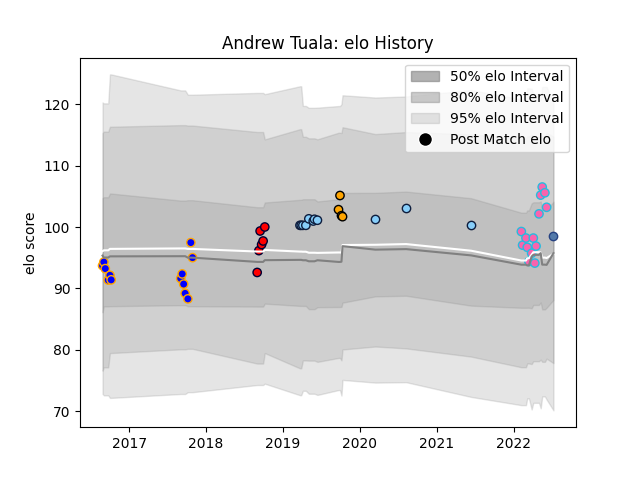

---  
layout: page  
title: Andrew Tuala  
date: 2023-03-02 11:21:00.625921  
categories: player  
---
# Andrew Tuala

## Positions: H, P

## Country: Samoa

## Current elo: 99.0

## Current Percentile: 75.0

# Elo History

# Match History

| Team                     |   Appearances |   Win Rate |
|:-------------------------|--------------:|-----------:|
| L. A. Giltinis           |            14 |   0.642857 |
| Greater Sydney Rams      |            13 |   0.384615 |
| New South Wales Waratahs |            11 |   0.363636 |
| Melbourne Rising         |             6 |   0.166667 |
| NSW Country Eagles       |             4 |   0.25     |
| Samoa                    |             1 |   1        |

| Opponent               |   Matches |   Win Rate |
|:-----------------------|----------:|-----------:|
| Brisbane City          |         4 |   0.25     |
| NSW Country Eagles     |         3 |   0.666667 |
| Canberra Vikings       |         3 |   0        |
| Queensland Country     |         3 |   0.333333 |
| Houston SaberCats      |         2 |   0.5      |
| Utah Warriors          |         2 |   0.5      |
| Seattle Seawolves      |         2 |   0.5      |
| Perth Spirit           |         2 |   0        |
| Melbourne Rising       |         2 |   0.5      |
| Melbourne Rebels       |         2 |   1        |
| Austin Gilgronis       |         2 |   0.5      |
| Western Force          |         2 |   0.5      |
| Fijian Drua            |         2 |   0        |
| Rugby ATL              |         1 |   1        |
| Brumbies               |         1 |   0        |
| Toronto Arrows         |         1 |   1        |
| Tonga                  |         1 |   1        |
| Sydney Rays            |         1 |   1        |
| Sunwolves              |         1 |   0        |
| Bulls                  |         1 |   0        |
| San Diego Legion       |         1 |   0        |
| Highlanders            |         1 |   0        |
| Jaguares               |         1 |   0        |
| Queensland Reds        |         1 |   1        |
| Chiefs                 |         1 |   0        |
| Crusaders              |         1 |   1        |
| North Harbour Rays     |         1 |   0        |
| New England Free Jacks |         1 |   1        |
| Blues                  |         1 |   0        |
| Dallas Jackals         |         1 |   1        |
| R.U. New York          |         1 |   1        |