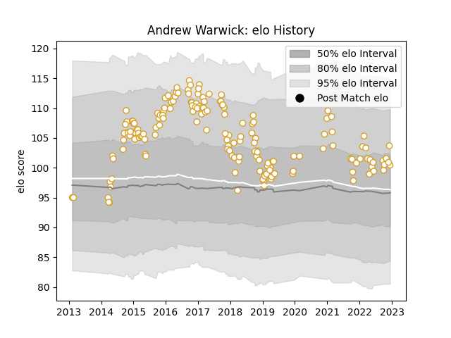

---  
layout: page  
title: Andrew Warwick  
date: 2022-12-09 13:19:32.444069  
categories: player  
---
# Andrew Warwick

## Positions: P

## Current elo: 104.0

## Current Percentile: 72.0

# Elo History

# Match History

| Team   |   Appearances |   Win Rate |
|:-------|--------------:|-----------:|
| Ulster |           163 |   0.610429 |

| Opponent          |   Matches |   Win Rate |
|:------------------|----------:|-----------:|
| Leinster          |        20 |   0.3      |
| Connacht          |        13 |   0.692308 |
| Scarlets          |        13 |   0.5      |
| Glasgow Warriors  |        13 |   0.461538 |
| Edinburgh         |        13 |   0.769231 |
| Munster           |        12 |   0.333333 |
| Benetton Treviso  |        11 |   0.954545 |
| Ospreys           |        10 |   0.8      |
| Zebre             |         9 |   0.888889 |
| Dragons           |         8 |   0.8125   |
| Cardiff Blues     |         8 |   0.6875   |
| Harlequins        |         4 |   1        |
| Leicester Tigers  |         4 |   0.75     |
| Southern Kings    |         4 |   1        |
| Cheetahs          |         2 |   0.75     |
| Toulon            |         2 |   0        |
| Stade Toulousain  |         2 |   1        |
| Exeter Chiefs     |         2 |   0.5      |
| Clermont Auvergne |         2 |   0.5      |
| Bordeaux Begles   |         2 |   0        |
| Racing 92         |         2 |   0.5      |
| Saracens          |         1 |   0        |
| Bulls             |         1 |   0        |
| Sharks            |         1 |   1        |
| Lions             |         1 |   1        |
| Stormers          |         1 |   0        |
| La Rochelle       |         1 |   0        |
| Wasps             |         1 |   0        |