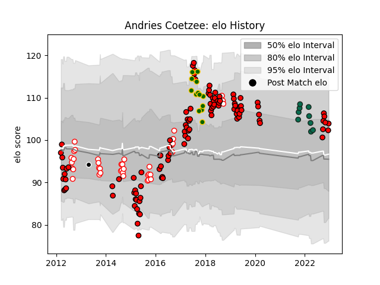

---  
layout: page  
title: Andries Coetzee  
date: 2023-03-21 18:24:39.038467  
categories: player  
---
# Andries Coetzee

Last updated: 2023-03-21
## Positions: FB

## Country: South Africa

## Current elo: 102.0

## Current Percentile: 64.0

# Elo History

# Match History

| Team             |   Appearances |   Win Rate |
|:-----------------|--------------:|-----------:|
| Lions            |           107 |   0.560748 |
| Golden Lions     |            45 |   0.633333 |
| South Africa     |            13 |   0.615385 |
| Benetton Treviso |             9 |   0.222222 |
| Sharks           |             1 |   0        |

| Opponent                 |   Matches |   Win Rate |
|:-------------------------|----------:|-----------:|
| Sharks                   |        15 |   0.533333 |
| Western Province         |        13 |   0.5      |
| Stormers                 |        13 |   0.5      |
| Bulls                    |         9 |   0.444444 |
| Crusaders                |         8 |   0.125    |
| Free State Cheetahs      |         7 |   0.571429 |
| Blue Bulls               |         7 |   0.714286 |
| Jaguares                 |         7 |   0.714286 |
| Cheetahs                 |         7 |   0.714286 |
| New South Wales Waratahs |         6 |   0.833333 |
| Natal Sharks             |         6 |   0.5      |
| Griquas                  |         6 |   0.666667 |
| Brumbies                 |         5 |   0.4      |
| Queensland Reds          |         5 |   0.6      |
| Hurricanes               |         5 |   0.2      |
| Highlanders              |         5 |   0.6      |
| Eastern Province Kings   |         4 |   1        |
| France                   |         4 |   1        |
| Blues                    |         4 |   0.25     |
| Melbourne Rebels         |         4 |   0.75     |
| Southern Kings           |         3 |   1        |
| Chiefs                   |         3 |   0.666667 |
| Sunwolves                |         3 |   1        |
| Ospreys                  |         2 |   0.5      |
| Western Force            |         2 |   0.5      |
| New Zealand              |         2 |   0        |
| Argentina                |         2 |   1        |
| Australia                |         2 |   0.5      |
| Edinburgh                |         2 |   1        |
| Munster                  |         1 |   0        |
| Lions                    |         1 |   0        |
| Leinster                 |         1 |   0        |
| Pumas                    |         1 |   1        |
| Ireland                  |         1 |   0        |
| Scarlets                 |         1 |   0        |
| Dragons                  |         1 |   0.5      |
| Stade Francais Paris     |         1 |   1        |
| Connacht                 |         1 |   0        |
| Cardiff Blues            |         1 |   1        |
| Ulster                   |         1 |   0        |
| Wales                    |         1 |   0        |
| Boland Cavaliers         |         1 |   1        |
| Italy                    |         1 |   1        |