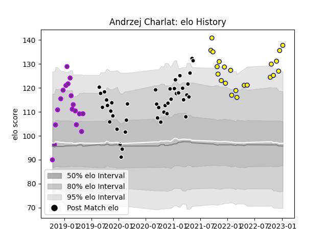

---  
layout: page  
title: Andrzej Charlat  
date: 2022-12-18 16:36:07.775038  
categories: player  
---
# Andrzej Charlat

## Positions: W

## Current elo: 109.0

## Current Percentile: 79.0

# Elo History

# Match History

| Team           |   Appearances |   Win Rate |
|:---------------|--------------:|-----------:|
| Provence Rugby |            39 |   0.525641 |
| Nevers         |            21 |   0.428571 |
| US Bressane    |            15 |   0.533333 |

| Opponent                   |   Matches |   Win Rate |
|:---------------------------|----------:|-----------:|
| Mont-de-Marsan             |         8 |   0.25     |
| Montauban                  |         6 |   0.666667 |
| Colomiers                  |         6 |   0.333333 |
| Oyonnax                    |         5 |   0.4      |
| Nevers                     |         5 |   0.6      |
| Aurillac                   |         5 |   0.6      |
| Carcassonne                |         5 |   0.2      |
| Vannes                     |         4 |   0.5      |
| Biarritz Olympique         |         4 |   0.375    |
| Beziers                    |         4 |   0.5      |
| Grenoble                   |         3 |   0.5      |
| Bayonne                    |         3 |   0.166667 |
| Perpignan                  |         3 |   0.333333 |
| Provence Rugby             |         3 |   0.666667 |
| Rouen                      |         3 |   1        |
| Soyaux-Angouleme           |         3 |   0.666667 |
| Valence Romans Drome Rugby |         2 |   1        |
| Agen                       |         2 |   1        |
| Roval Drome XV             |         1 |   1        |