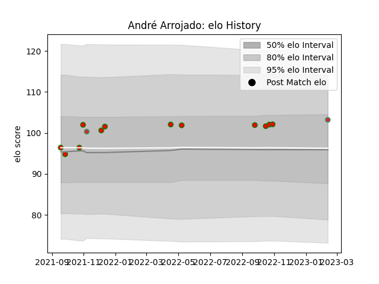

---  
layout: page  
title: André Arrojado  
date: 2023-02-15 22:12:51.735755  
categories: player  
---
# André Arrojado

## Positions: P

## Country: Portugal

## Current elo: 103.0

## Current Percentile: 68.0

# Elo History

# Match History

| Team         |   Appearances |   Win Rate |
|:-------------|--------------:|-----------:|
| Lusitanos XV |            12 |   0.833333 |
| Portugal     |             2 |   1        |

| Opponent                 |   Matches |   Win Rate |
|:-------------------------|----------:|-----------:|
| Castilla y Leon Iberians |         4 |       0.75 |
| Brussels Devils          |         3 |       1    |
| Delta                    |         3 |       1    |
| Black Lion               |         1 |       0    |
| Canada                   |         1 |       1    |
| Poland                   |         1 |       1    |
| Tel-Aviv Heat            |         1 |       1    |