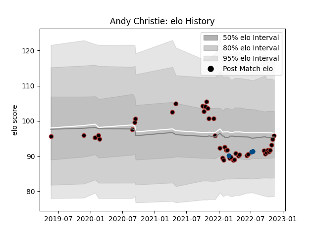

---  
layout: page  
title: Andy Christie  
date: 2022-11-15 23:41:56.916679  
categories: player  
---
# Andy Christie

## Positions: FL, N8

## Country: Scotland

## Current elo: 96.0

## Current Percentile: 47.0

# Elo History

# Match History

| Team     |   Appearances |   Win Rate |
|:---------|--------------:|-----------:|
| Saracens |            42 |   0.72619  |
| Scotland |             3 |   0.333333 |

| Opponent           |   Matches |   Win Rate |
|:-------------------|----------:|-----------:|
| Harlequins         |         5 |   0.8      |
| Sale Sharks        |         4 |   0.75     |
| Exeter Chiefs      |         4 |   0.75     |
| Leicester Tigers   |         4 |   0.5      |
| Bath Rugby         |         3 |   1        |
| Wasps              |         3 |   0.333333 |
| Newcastle Falcons  |         3 |   1        |
| London Irish       |         3 |   0.5      |
| Gloucester Rugby   |         3 |   0.666667 |
| Argentina          |         2 |   0.5      |
| Bristol Rugby      |         2 |   1        |
| Worcester Warriors |         2 |   0.5      |
| France             |         1 |   0        |
| Edinburgh          |         1 |   0        |
| Brive              |         1 |   1        |
| Northampton Saints |         1 |   1        |
| Nottingham         |         1 |   1        |
| Ospreys            |         1 |   1        |
| Bedford            |         1 |   1        |