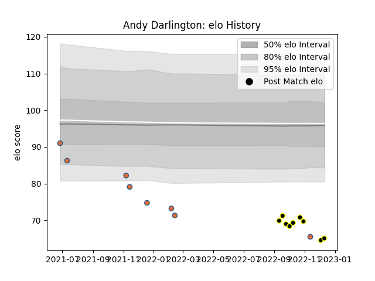

---  
layout: page  
title: Andy Darlington  
date: 2022-12-18 16:40:15.149682  
categories: player  
---
# Andy Darlington

## Positions: P

## Country: Netherlands

## Current elo: 65.0

## Current Percentile: 0.0

# Elo History

# Match History

| Team        |   Appearances |   Win Rate |
|:------------|--------------:|-----------:|
| Caldy       |             9 |   0.222222 |
| Netherlands |             8 |   0        |

| Opponent         |   Matches |   Win Rate |
|:-----------------|----------:|-----------:|
| Georgia          |         2 |          0 |
| Spain            |         2 |          0 |
| Ampthill         |         1 |          0 |
| Bedford          |         1 |          0 |
| Canada           |         1 |          0 |
| Cornish Pirates  |         1 |          1 |
| Coventry         |         1 |          0 |
| Hartpury College |         1 |          0 |
| Jersey           |         1 |          0 |
| London Scottish  |         1 |          0 |
| Nottingham       |         1 |          0 |
| Portugal         |         1 |          0 |
| Richmond         |         1 |          1 |
| Romania          |         1 |          0 |
| Russia           |         1 |          0 |