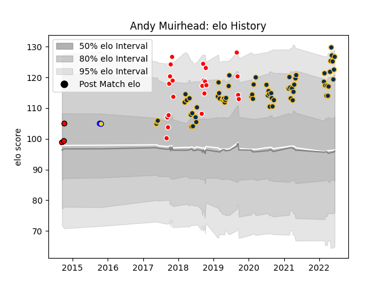

---  
layout: page  
title: Andy Muirhead  
date: 2023-03-21 18:22:49.392505  
categories: player  
---
# Andy Muirhead

Last updated: 2023-03-21
## Positions: W, FB

## Current elo: 131.0

## Current Percentile: 96.0

# Elo History

# Match History

| Team             |   Appearances |   Win Rate |
|:-----------------|--------------:|-----------:|
| Brumbies         |            69 |   0.681159 |
| Canberra Vikings |            22 |   0.636364 |
| Brisbane City    |             3 |   1        |
| Counties Manukau |             3 |   0.666667 |

| Opponent                 |   Matches |   Win Rate |
|:-------------------------|----------:|-----------:|
| Queensland Reds          |        11 |   0.545455 |
| New South Wales Waratahs |        10 |   0.9      |
| Melbourne Rebels         |        10 |   0.5      |
| Western Force            |         9 |   0.888889 |
| Fijian Drua              |         5 |   0.6      |
| Chiefs                   |         4 |   0.75     |
| Queensland Country       |         4 |   0.25     |
| Hurricanes               |         4 |   0.75     |
| Blues                    |         4 |   0.5      |
| Brisbane City            |         3 |   0.666667 |
| Crusaders                |         3 |   0        |
| Melbourne Rising         |         3 |   1        |
| NSW Country Eagles       |         2 |   0.5      |
| Sydney Rays              |         2 |   1        |
| Sunwolves                |         2 |   1        |
| Perth Spirit             |         2 |   1        |
| Moana Pasifika           |         2 |   0.5      |
| Lions                    |         2 |   0.5      |
| Jaguares                 |         2 |   0.5      |
| Highlanders              |         2 |   0.5      |
| Greater Sydney Rams      |         2 |   1        |
| Sharks                   |         1 |   1        |
| Southern Kings           |         1 |   1        |
| Southland                |         1 |   1        |
| Stormers                 |         1 |   1        |
| Canberra Vikings         |         1 |   1        |
| Bulls                    |         1 |   1        |
| Sydney Stars             |         1 |   1        |
| Waikato                  |         1 |   0        |
| Auckland                 |         1 |   1        |