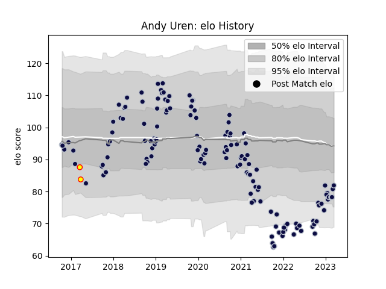

---  
layout: page  
title: Andy Uren  
date: 2022-12-09 13:11:37.178702  
categories: player  
---
# Andy Uren

## Positions: SH

## Current elo: 72.0

## Current Percentile: 0.0

# Elo History

# Match History

| Team          |   Appearances |   Win Rate |
|:--------------|--------------:|-----------:|
| Bristol Rugby |           114 |   0.583333 |
| Richmond      |             1 |   0        |

| Opponent             |   Matches |   Win Rate |
|:---------------------|----------:|-----------:|
| Bath Rugby           |         9 |   0.777778 |
| Sale Sharks          |         9 |   0.277778 |
| Exeter Chiefs        |         9 |   0.333333 |
| Northampton Saints   |         9 |   0.555556 |
| Worcester Warriors   |         8 |   0.625    |
| Harlequins           |         8 |   0.5      |
| Leicester Tigers     |         7 |   0.642857 |
| Wasps                |         7 |   0.285714 |
| Gloucester Rugby     |         7 |   0.857143 |
| Newcastle Falcons    |         7 |   0.571429 |
| Saracens             |         6 |   0.333333 |
| London Irish         |         5 |   0.8      |
| Zebre                |         4 |   0.625    |
| La Rochelle          |         2 |   0.5      |
| RC Enisei            |         2 |   1        |
| Cardiff Blues        |         2 |   0        |
| Yorkshire Carnegie   |         2 |   0.5      |
| London Scottish      |         2 |   1        |
| Bedford              |         1 |   1        |
| Jersey               |         1 |   0        |
| Hartpury College     |         1 |   1        |
| Pau                  |         1 |   1        |
| Richmond             |         1 |   1        |
| Rotherham Titans     |         1 |   1        |
| Dragons              |         1 |   1        |
| Stade Francais Paris |         1 |   1        |
| Brive                |         1 |   1        |
| Bordeaux Begles      |         1 |   1        |