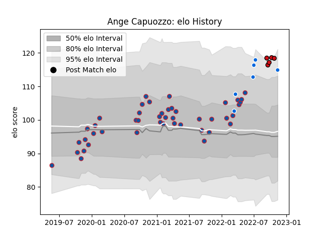

---  
layout: page  
title: Ange Capuozzo  
date: 2023-01-23 15:29:52.271757  
categories: player  
---
# Ange Capuozzo

## Positions: FB, W

## Country: Italy

## Current elo: 104.0

## Current Percentile: 72.0

# Elo History

# Match History

| Team             |   Appearances |   Win Rate |
|:-----------------|--------------:|-----------:|
| Grenoble         |            51 |   0.588235 |
| Stade Toulousain |             9 |   0.777778 |
| Italy            |             7 |   0.571429 |

| Opponent                   |   Matches |   Win Rate |
|:---------------------------|----------:|-----------:|
| Perpignan                  |         5 |   0.4      |
| Rouen                      |         5 |   0.6      |
| Nevers                     |         4 |   0.875    |
| Montauban                  |         4 |   0.625    |
| Aurillac                   |         4 |   0.75     |
| Provence Rugby             |         4 |   0.25     |
| Soyaux-Angouleme           |         3 |   1        |
| Biarritz Olympique         |         3 |   0.166667 |
| Beziers                    |         3 |   0.333333 |
| Oyonnax                    |         3 |   0.666667 |
| Vannes                     |         3 |   0.333333 |
| Mont-de-Marsan             |         2 |   1        |
| Munster                    |         2 |   1        |
| Bayonne                    |         2 |   0.5      |
| Pau                        |         2 |   0        |
| Valence Romans Drome Rugby |         1 |   1        |
| US Bressane                |         1 |   1        |
| Toulon                     |         1 |   1        |
| South Africa               |         1 |   0        |
| Racing 92                  |         1 |   1        |
| Romania                    |         1 |   1        |
| Scotland                   |         1 |   0        |
| Agen                       |         1 |   1        |
| Portugal                   |         1 |   1        |
| Narbonne                   |         1 |   0.5      |
| Lyon                       |         1 |   0        |
| La Rochelle                |         1 |   1        |
| Georgia                    |         1 |   0        |
| Colomiers                  |         1 |   1        |
| Clermont Auvergne          |         1 |   1        |
| Carcassonne                |         1 |   1        |
| Australia                  |         1 |   1        |
| Wales                      |         1 |   1        |