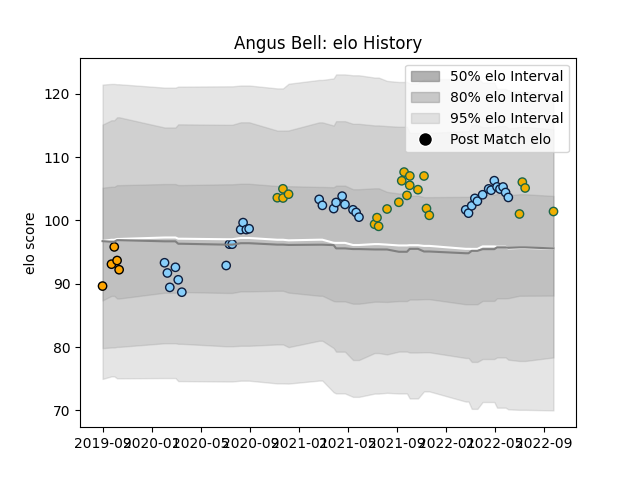

---  
layout: page  
title: Angus Bell  
date: 2023-02-24 09:50:32.620457  
categories: player  
---
# Angus Bell

## Positions: P

## Country: Australia

## Current elo: 101.0

## Current Percentile: 78.0

# Elo History

# Match History

| Team                     |   Appearances |   Win Rate |
|:-------------------------|--------------:|-----------:|
| New South Wales Waratahs |            36 |   0.361111 |
| Australia                |            22 |   0.522727 |
| NSW Country Eagles       |             5 |   0.4      |

| Opponent           |   Matches |   Win Rate |
|:-------------------|----------:|-----------:|
| Argentina          |         6 |   0.75     |
| Brumbies           |         6 |   0        |
| Western Force      |         6 |   0.833333 |
| Queensland Reds    |         5 |   0.2      |
| England            |         4 |   0.25     |
| Melbourne Rebels   |         4 |   0.5      |
| New Zealand        |         4 |   0.25     |
| Chiefs             |         3 |   0        |
| Crusaders          |         3 |   0.333333 |
| France             |         3 |   0.666667 |
| Blues              |         3 |   0        |
| Fijian Drua        |         2 |   1        |
| Hurricanes         |         2 |   0        |
| South Africa       |         2 |   1        |
| Brisbane City      |         1 |   0        |
| Wales              |         1 |   0        |
| Sydney Rays        |         1 |   1        |
| Scotland           |         1 |   0        |
| Lions              |         1 |   1        |
| Queensland Country |         1 |   0        |
| Moana Pasifika     |         1 |   1        |
| Canberra Vikings   |         1 |   0        |
| Highlanders        |         1 |   1        |
| Japan              |         1 |   1        |