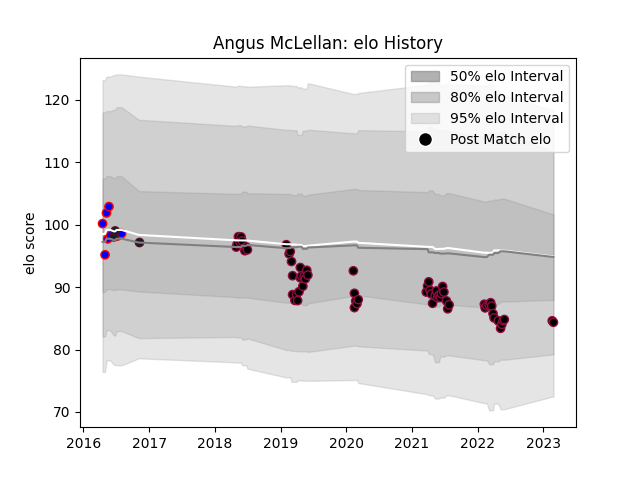

---  
layout: page  
title: Angus McLellan  
date: 2023-03-21 18:54:07.361643  
categories: player  
---
# Angus McLellan

Last updated: 2023-03-21
## Positions: P

## Country: United States of America

## Current elo: 85.0

## Current Percentile: 17.0

# Elo History

# Match History

| Team                     |   Appearances |   Win Rate |
|:-------------------------|--------------:|-----------:|
| Utah Warriors            |            67 |   0.380597 |
| Ohio                     |             9 |   0.666667 |
| United States of America |             3 |   0.333333 |

| Opponent               |   Matches |   Win Rate |
|:-----------------------|----------:|-----------:|
| Seattle Seawolves      |         8 |   0.3125   |
| San Diego Legion       |         8 |   0.125    |
| Houston SaberCats      |         8 |   0.5      |
| NOLA Gold              |         5 |   0        |
| L. A. Giltinis         |         5 |   0.4      |
| Austin Elite Rugby     |         4 |   0.75     |
| Glendale Raptors       |         4 |   0.125    |
| Toronto Arrows         |         4 |   0.25     |
| Rugby ATL              |         3 |   0.333333 |
| Austin Gilgronis       |         3 |   0.666667 |
| Sacramento             |         3 |   1        |
| R.U. New York          |         3 |   0.333333 |
| New England Free Jacks |         3 |   0.666667 |
| Rugby New York         |         2 |   0        |
| Dallas Jackals         |         2 |   1        |
| San Diego              |         2 |   0.5      |
| San Francisco          |         2 |   0.5      |
| Austin Herd            |         2 |   0.75     |
| Denver                 |         2 |   0.5      |
| New Zealand Maori      |         1 |   0        |
| Old Glory DC           |         1 |   1        |
| Colorado Raptors       |         1 |   0        |
| Italy                  |         1 |   0        |
| Russia                 |         1 |   1        |
| Chicago Hounds         |         1 |   1        |