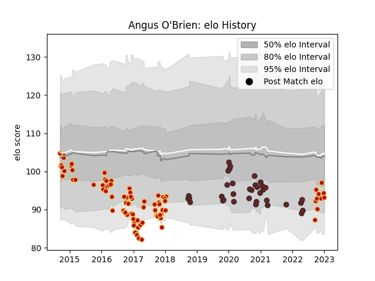

---  
layout: page  
title: Angus O'Brien  
date: 2022-12-12 15:20:26.625744  
categories: player  
---
# Angus O'Brien

## Positions: FH, FB

## Current elo: 83.0

## Current Percentile: 7.0

# Elo History

# Match History

| Team     |   Appearances |   Win Rate |
|:---------|--------------:|-----------:|
| Dragons  |            82 |   0.27439  |
| Scarlets |            34 |   0.588235 |

| Opponent             |   Matches |   Win Rate |
|:---------------------|----------:|-----------:|
| Cardiff Blues        |        10 |   0.3      |
| Edinburgh            |        10 |   0.2      |
| Ospreys              |         8 |   0.375    |
| Scarlets             |         7 |   0.285714 |
| Ulster               |         7 |   0.214286 |
| Munster              |         7 |   0.142857 |
| Benetton Treviso     |         7 |   0.571429 |
| Leinster             |         6 |   0        |
| Connacht             |         6 |   0.5      |
| Zebre                |         5 |   0.6      |
| Newcastle Falcons    |         4 |   0.25     |
| Glasgow Warriors     |         4 |   0        |
| Dragons              |         4 |   0.75     |
| RC Enisei            |         4 |   0.75     |
| Southern Kings       |         3 |   1        |
| Gloucester Rugby     |         2 |   0.5      |
| Stade Francais Paris |         2 |   1        |
| Toulon               |         2 |   0        |
| Brive                |         2 |   0.5      |
| Worcester Warriors   |         2 |   0.5      |
| Sale Sharks          |         1 |   0        |
| Sharks               |         1 |   0        |
| Stormers             |         1 |   0        |
| Bayonne              |         1 |   1        |
| Racing 92            |         1 |   0        |
| Northampton Saints   |         1 |   0        |
| London Welsh         |         1 |   1        |
| London Irish         |         1 |   1        |
| Lions                |         1 |   0        |
| Exeter Chiefs        |         1 |   0        |
| Cheetahs             |         1 |   1        |
| Castres Olympique    |         1 |   1        |
| Bordeaux Begles      |         1 |   0        |
| Montpellier Herault  |         1 |   0        |