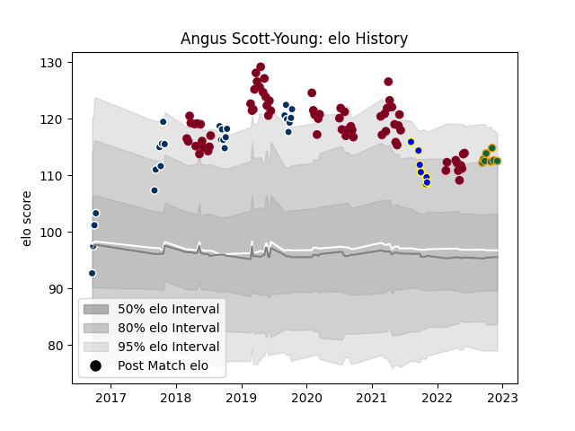

---  
layout: page  
title: Angus Scott-Young  
date: 2022-11-16 11:25:46.792932  
categories: player  
---
# Angus Scott-Young

## Positions: FL

## Current elo: 96.0

## Current Percentile: 58.0

# Elo History

# Match History

| Team               |   Appearances |   Win Rate |
|:-------------------|--------------:|-----------:|
| Queensland Reds    |            69 |   0.456522 |
| Bay of Plenty      |             7 |   0.285714 |
| Northampton Saints |             7 |   0.428571 |

| Opponent                 |   Matches |   Win Rate |
|:-------------------------|----------:|-----------:|
| Brumbies                 |        10 |   0.6      |
| Melbourne Rebels         |        10 |   0.75     |
| New South Wales Waratahs |         9 |   0.444444 |
| Crusaders                |         5 |   0        |
| Blues                    |         4 |   0.25     |
| Highlanders              |         4 |   0        |
| Sunwolves                |         4 |   0.75     |
| Western Force            |         4 |   0.75     |
| Chiefs                   |         4 |   0.25     |
| Hurricanes               |         3 |   0        |
| Jaguares                 |         3 |   0.333333 |
| Bulls                    |         3 |   0.666667 |
| Lions                    |         2 |   0.5      |
| Sharks                   |         2 |   0.5      |
| Harlequins               |         1 |   0        |
| Saracens                 |         1 |   0        |
| Wellington               |         1 |   1        |
| Waikato                  |         1 |   0        |
| Tasman                   |         1 |   0        |
| Taranaki                 |         1 |   0        |
| Stormers                 |         1 |   0        |
| Northland                |         1 |   1        |
| Sale Sharks              |         1 |   0        |
| Hawke's Bay              |         1 |   0        |
| Canterbury               |         1 |   0        |
| Moana Pasifika           |         1 |   1        |
| Bristol Rugby            |         1 |   1        |
| Leicester Tigers         |         1 |   0        |
| Exeter Chiefs            |         1 |   1        |
| London Irish             |         1 |   1        |