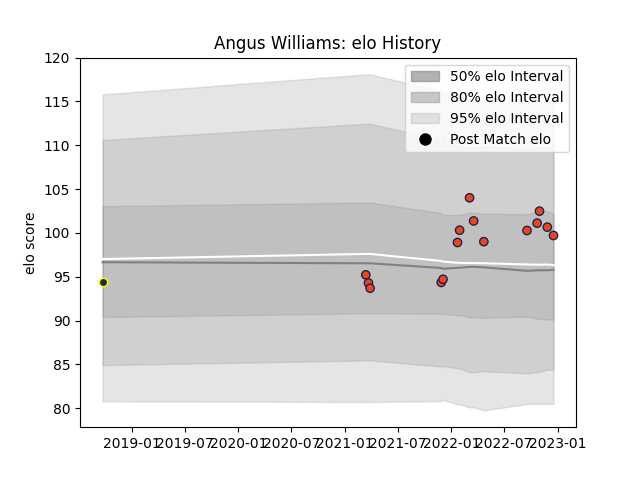

---  
layout: page  
title: Angus Williams  
date: 2022-12-18 16:16:30.590350  
categories: player  
---
# Angus Williams

## Positions: P

## Current elo: 100.0

## Current Percentile: 70.0

# Elo History

# Match History

| Team      |   Appearances |   Win Rate |
|:----------|--------------:|-----------:|
| Edinburgh |            15 |   0.666667 |
| Otago     |             1 |   0        |

| Opponent          |   Matches |   Win Rate |
|:------------------|----------:|-----------:|
| Dragons           |         3 |   0.666667 |
| Benetton Treviso  |         2 |   0.5      |
| Cardiff Blues     |         2 |   0.5      |
| Connacht          |         2 |   1        |
| Zebre             |         2 |   1        |
| Brive             |         1 |   1        |
| Canterbury        |         1 |   0        |
| Castres Olympique |         1 |   1        |
| Glasgow Warriors  |         1 |   0        |
| Ospreys           |         1 |   0        |