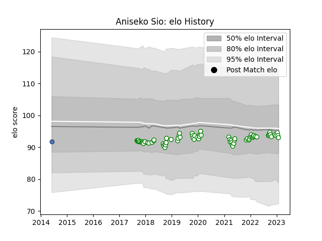

---  
layout: page  
title: Aniseko Sio  
date: 2023-01-17 11:41:22.651561  
categories: player  
---
# Aniseko Sio

## Positions: P

## Country: Samoa

## Current elo: 95.0

## Current Percentile: 44.0

# Elo History

# Match History

| Team       |   Appearances |   Win Rate |
|:-----------|--------------:|-----------:|
| Nottingham |            72 |   0.430556 |
| Samoa      |             1 |   0        |

| Opponent            |   Matches |   Win Rate |
|:--------------------|----------:|-----------:|
| Doncaster           |         8 |   0.25     |
| Jersey              |         7 |   0.214286 |
| Cornish Pirates     |         7 |   0.285714 |
| Coventry            |         7 |   0.357143 |
| Hartpury College    |         7 |   0.428571 |
| Richmond            |         6 |   0.833333 |
| London Scottish     |         6 |   1        |
| Bedford             |         6 |   0.5      |
| Ealing Trailfinders |         5 |   0.2      |
| Ampthill            |         3 |   0.333333 |
| Yorkshire Carnegie  |         3 |   0.333333 |
| Rotherham Titans    |         2 |   1        |
| London Irish        |         1 |   0        |
| Caldy               |         1 |   1        |
| Newcastle Falcons   |         1 |   0        |
| Bristol Rugby       |         1 |   0        |
| Saracens            |         1 |   0        |
| Japan               |         1 |   0        |