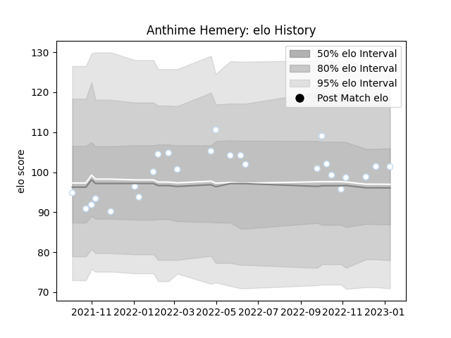

---  
layout: page  
title: Anthime Hemery  
date: 2023-01-13 11:33:00.232778  
categories: player  
---
# Anthime Hemery

## Positions: N8, FL

## Current elo: 101.0

## Current Percentile: 65.0

# Elo History

# Match History

| Team      |   Appearances |   Win Rate |
|:----------|--------------:|-----------:|
| Racing 92 |            25 |       0.48 |

| Opponent            |   Matches |   Win Rate |
|:--------------------|----------:|-----------:|
| Bordeaux Begles     |         4 |   0.25     |
| Brive               |         3 |   0.666667 |
| Montpellier Herault |         3 |   0        |
| Stade Toulousain    |         3 |   0.666667 |
| Clermont Auvergne   |         2 |   0.5      |
| Pau                 |         2 |   1        |
| Perpignan           |         2 |   0.5      |
| Toulon              |         2 |   1        |
| Biarritz Olympique  |         1 |   1        |
| Harlequins          |         1 |   0        |
| La Rochelle         |         1 |   0        |
| Lyon                |         1 |   0        |