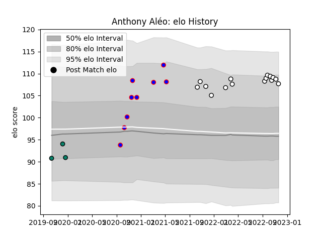

---  
layout: page  
title: Anthony Aléo  
date: 2023-01-17 11:33:57.628142  
categories: player  
---
# Anthony Aléo

## Positions: P

## Current elo: 102.0

## Current Percentile: 61.0

# Elo History

# Match History

| Team                       |   Appearances |   Win Rate |
|:---------------------------|--------------:|-----------:|
| Valence Romans Drome Rugby |            34 |   0.632353 |
| Beziers                    |            25 |   0.34     |
| Montauban                  |            13 |   0.423077 |

| Opponent                   |   Matches |   Win Rate |
|:---------------------------|----------:|-----------:|
| Soyaux-Angouleme           |         5 |   0.3      |
| Albi                       |         3 |   0.333333 |
| Chambery                   |         3 |   0.666667 |
| Tarbes                     |         3 |   0.666667 |
| Perpignan                  |         3 |   0.333333 |
| Oyonnax                    |         3 |   0        |
| Grenoble                   |         3 |   0.666667 |
| Colomiers                  |         3 |   0.333333 |
| Mont-de-Marsan             |         3 |   0        |
| Blagnac                    |         3 |   0.666667 |
| Bourgoin-Jallieu           |         3 |   0.5      |
| Biarritz Olympique         |         3 |   0.666667 |
| Vannes                     |         3 |   0.333333 |
| Dijon                      |         2 |   0.5      |
| Nice                       |         2 |   1        |
| Aurillac                   |         2 |   1        |
| Rouen                      |         2 |   0        |
| Dax                        |         2 |   0.5      |
| Carcassonne                |         2 |   0.5      |
| Cognac Saint Jean d'Angély |         2 |   1        |
| Provence Rugby             |         2 |   0        |
| Montauban                  |         2 |   1        |
| Aubenas                    |         2 |   1        |
| Massy                      |         2 |   0        |
| Nevers                     |         1 |   0        |
| Narbonne                   |         1 |   1        |
| Rennes                     |         1 |   1        |
| Roval Drome XV             |         1 |   1        |
| Beziers                    |         1 |   0        |
| Suresnes                   |         1 |   1        |
| US Bressane                |         1 |   0        |
| Valence Romans Drome Rugby |         1 |   0.5      |
| Carqueiranne-Hyères        |         1 |   1        |