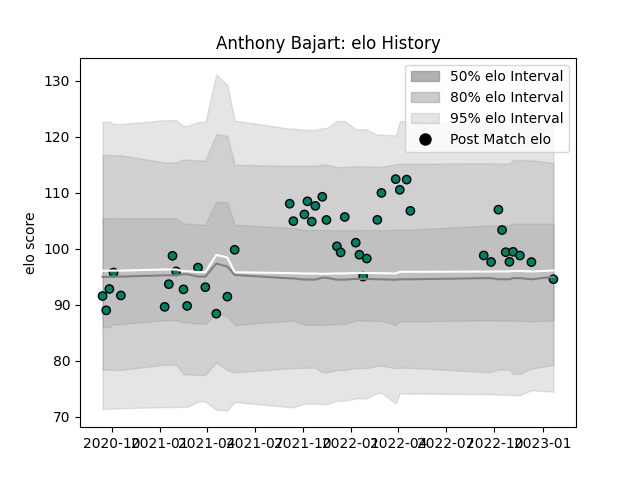

---  
layout: page  
title: Anthony Bajart  
date: 2022-12-18 16:30:43.305799  
categories: player  
---
# Anthony Bajart

## Positions: H

## Current elo: 86.0

## Current Percentile: 19.0

# Elo History

# Match History

| Team     |   Appearances |   Win Rate |
|:---------|--------------:|-----------:|
| Suresnes |            34 |   0.470588 |

| Opponent                   |   Matches |   Win Rate |
|:---------------------------|----------:|-----------:|
| Blagnac                    |         4 |   0.25     |
| Cognac Saint Jean d'Angély |         4 |   0.5      |
| Dax                        |         3 |   0.666667 |
| Nice                       |         3 |   0.333333 |
| Tarbes                     |         3 |   0.666667 |
| Valence Romans Drome Rugby |         3 |   0        |
| Bourgoin-Jallieu           |         2 |   1        |
| Chambery                   |         2 |   0        |
| Dijon                      |         2 |   1        |
| Narbonne                   |         2 |   0.5      |
| US Bressane                |         2 |   0        |
| Albi                       |         1 |   1        |
| Aubenas                    |         1 |   1        |
| Carqueiranne-Hyères        |         1 |   1        |
| Massy                      |         1 |   0        |