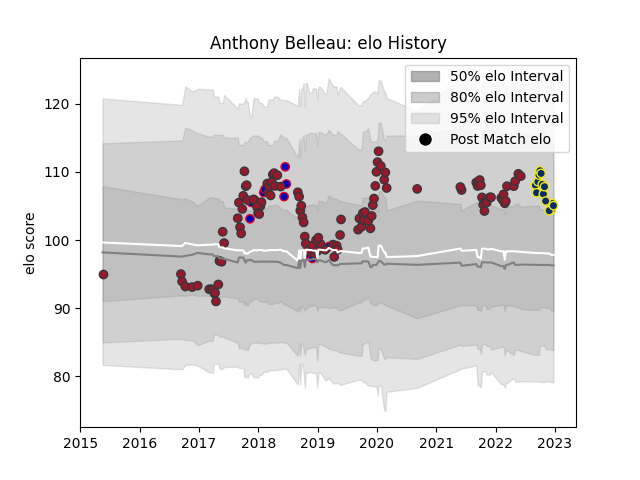

---  
layout: page  
title: Anthony Belleau  
date: 2023-02-02 18:39:48.779217  
categories: player  
---
# Anthony Belleau

## Positions: FH, C

## Country: France

## Current elo: 106.0

## Current Percentile: 72.0

# Elo History

# Match History

| Team              |   Appearances |   Win Rate |
|:------------------|--------------:|-----------:|
| Toulon            |           111 |   0.536036 |
| Clermont Auvergne |            19 |   0.342105 |
| France            |            12 |   0.166667 |

| Opponent             |   Matches |   Win Rate |
|:---------------------|----------:|-----------:|
| La Rochelle          |        11 |   0.5      |
| Stade Toulousain     |        11 |   0.5      |
| Castres Olympique    |        11 |   0.545455 |
| Lyon                 |         9 |   0.5      |
| Clermont Auvergne    |         9 |   0.333333 |
| Montpellier Herault  |         8 |   0.375    |
| Brive                |         8 |   0.375    |
| Stade Francais Paris |         7 |   0.428571 |
| Bordeaux Begles      |         7 |   0.785714 |
| Pau                  |         7 |   0.785714 |
| Racing 92            |         7 |   0.142857 |
| New Zealand          |         4 |   0        |
| Scarlets             |         4 |   0.75     |
| Perpignan            |         4 |   0.75     |
| Agen                 |         3 |   0.666667 |
| Grenoble             |         3 |   0.5      |
| Newcastle Falcons    |         2 |   0.5      |
| South Africa         |         2 |   0        |
| Stormers             |         2 |   0.5      |
| Oyonnax              |         2 |   0.5      |
| Scotland             |         2 |   0.5      |
| London Irish         |         2 |   1        |
| Leicester Tigers     |         2 |   0        |
| Ireland              |         2 |   0        |
| Edinburgh            |         2 |   0        |
| Biarritz Olympique   |         2 |   1        |
| Benetton Treviso     |         2 |   1        |
| Bayonne              |         2 |   0.5      |
| Munster              |         1 |   0        |
| Argentina            |         1 |   1        |
| Fiji                 |         1 |   0        |
| Bath Rugby           |         1 |   1        |
| Toulon               |         1 |   0        |