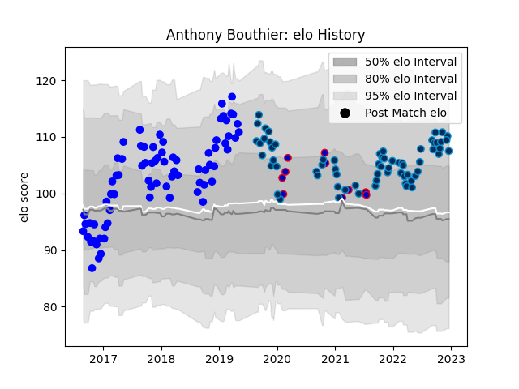

---  
layout: page  
title: Anthony Bouthier  
date: 2022-11-16 11:31:47.404034  
categories: player  
---
# Anthony Bouthier

## Positions: FB, FH

## Country: France

## Current elo: 113.0

## Current Percentile: 86.0

# Elo History

# Match History

| Team                |   Appearances |   Win Rate |
|:--------------------|--------------:|-----------:|
| Vannes              |            75 |   0.546667 |
| Montpellier Herault |            63 |   0.539683 |
| France              |            11 |   0.636364 |

| Opponent             |   Matches |   Win Rate |
|:---------------------|----------:|-----------:|
| Brive                |         7 |   0.5      |
| Biarritz Olympique   |         7 |   0.857143 |
| Aurillac             |         6 |   0.666667 |
| Stade Toulousain     |         6 |   0.166667 |
| Beziers              |         6 |   0.5      |
| Carcassonne          |         6 |   0.333333 |
| Castres Olympique    |         5 |   0.4      |
| La Rochelle          |         5 |   0.6      |
| Perpignan            |         5 |   0.6      |
| Lyon                 |         5 |   0.4      |
| Colomiers            |         5 |   0.6      |
| Pau                  |         5 |   0.6      |
| Racing 92            |         5 |   0.4      |
| Bordeaux Begles      |         5 |   0.5      |
| Bayonne              |         5 |   0.6      |
| Soyaux-Angouleme     |         5 |   0.6      |
| Massy                |         4 |   0.75     |
| Montauban            |         4 |   0.25     |
| Narbonne             |         4 |   0.5      |
| Dax                  |         4 |   0.25     |
| Stade Francais Paris |         4 |   0.875    |
| Toulon               |         4 |   0.625    |
| Clermont Auvergne    |         3 |   0.333333 |
| Mont-de-Marsan       |         3 |   0.666667 |
| Australia            |         3 |   0.333333 |
| Nevers               |         3 |   0.666667 |
| Oyonnax              |         3 |   0.666667 |
| Agen                 |         3 |   0.5      |
| Scotland             |         2 |   0        |
| US Bressane          |         2 |   0.75     |
| Wales                |         2 |   1        |
| Albi                 |         2 |   1        |
| Ireland              |         2 |   1        |
| Grenoble             |         2 |   0        |
| Connacht             |         2 |   0.5      |
| Provence Rugby       |         1 |   1        |
| Gloucester Rugby     |         1 |   1        |
| England              |         1 |   1        |
| Bourgoin-Jallieu     |         1 |   1        |
| Italy                |         1 |   1        |