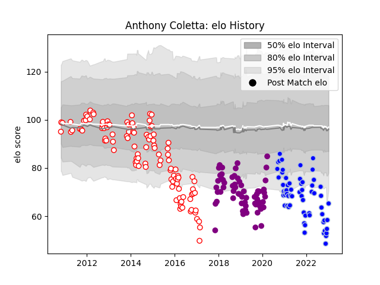

---  
layout: page  
title: Anthony Coletta  
date: 2023-01-13 11:29:51.071387  
categories: player  
---
# Anthony Coletta

## Positions: FL, L

## Current elo: 65.0

## Current Percentile: 1.0

# Elo History

# Match History

| Team             |   Appearances |   Win Rate |
|:-----------------|--------------:|-----------:|
| Dax              |           109 |   0.325688 |
| Colomiers        |            61 |   0.565574 |
| Soyaux-Angouleme |            61 |   0.57377  |

| Opponent                   |   Matches |   Win Rate |
|:---------------------------|----------:|-----------:|
| Carcassonne                |        19 |   0.263158 |
| Beziers                    |        14 |   0.571429 |
| Montauban                  |        14 |   0.535714 |
| Aurillac                   |        13 |   0.538462 |
| Mont-de-Marsan             |        12 |   0.416667 |
| Biarritz Olympique         |        12 |   0.333333 |
| Narbonne                   |        11 |   0.636364 |
| Perpignan                  |        10 |   0.35     |
| Colomiers                  |        10 |   0.3      |
| Vannes                     |        10 |   0.5      |
| Nevers                     |         9 |   0.722222 |
| Grenoble                   |         8 |   0.375    |
| Albi                       |         8 |   0.1875   |
| Oyonnax                    |         8 |   0.4375   |
| Provence Rugby             |         7 |   0.857143 |
| Tarbes                     |         7 |   0.428571 |
| Bourgoin-Jallieu           |         6 |   0.333333 |
| Bayonne                    |         6 |   0.666667 |
| Pau                        |         5 |   0        |
| US Bressane                |         5 |   0.6      |
| Soyaux-Angouleme           |         5 |   0.6      |
| Rouen                      |         5 |   0.8      |
| Agen                       |         5 |   0.2      |
| Massy                      |         5 |   0.5      |
| Lyon                       |         4 |   0        |
| Brive                      |         4 |   0.25     |
| Roval Drome XV             |         2 |   0.5      |
| La Rochelle                |         2 |   0.5      |
| Valence Romans Drome Rugby |         2 |   0.5      |
| Auch                       |         1 |   1        |
| Dax                        |         1 |   1        |
| Saint-Etienne              |         1 |   1        |