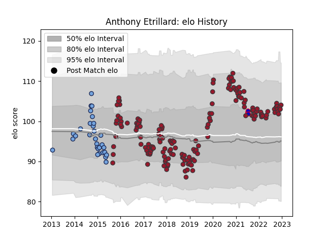

---  
layout: page  
title: Anthony Etrillard  
date: 2022-11-16 11:39:51.383102  
categories: player  
---
# Anthony Etrillard

## Positions: H

## Country: France

## Current elo: 106.0

## Current Percentile: 84.0

# Elo History

# Match History

| Team    |   Appearances |   Win Rate |
|:--------|--------------:|-----------:|
| Toulon  |           161 |   0.583851 |
| Bayonne |            30 |   0.416667 |
| France  |             3 |   0.333333 |

| Opponent             |   Matches |   Win Rate |
|:---------------------|----------:|-----------:|
| Castres Olympique    |        15 |   0.533333 |
| Stade Toulousain     |        14 |   0.535714 |
| La Rochelle          |        14 |   0.5      |
| Montpellier Herault  |        14 |   0.392857 |
| Stade Francais Paris |        13 |   0.615385 |
| Lyon                 |        12 |   0.541667 |
| Clermont Auvergne    |        12 |   0.583333 |
| Bordeaux Begles      |        11 |   0.545455 |
| Brive                |        11 |   0.454545 |
| Pau                  |        11 |   0.863636 |
| Racing 92            |         8 |   0.25     |
| Grenoble             |         8 |   0.4375   |
| Bayonne              |         6 |   0.666667 |
| Agen                 |         6 |   0.666667 |
| Scarlets             |         5 |   0.8      |
| Perpignan            |         4 |   0.75     |
| Bath Rugby           |         3 |   0.666667 |
| Australia            |         3 |   0.333333 |
| Oyonnax              |         3 |   0.333333 |
| Newcastle Falcons    |         2 |   0.5      |
| Wasps                |         2 |   0.5      |
| Leinster             |         2 |   1        |
| Arix Viadana         |         2 |   1        |
| Edinburgh            |         2 |   0        |
| Benetton Treviso     |         2 |   1        |
| London Irish         |         1 |   1        |
| Munster              |         1 |   0        |
| Exeter Chiefs        |         1 |   0        |
| Dragons              |         1 |   1        |
| Sale Sharks          |         1 |   1        |
| Bristol Rugby        |         1 |   0        |
| Biarritz Olympique   |         1 |   1        |
| Toulon               |         1 |   0        |
| Leicester Tigers     |         1 |   1        |