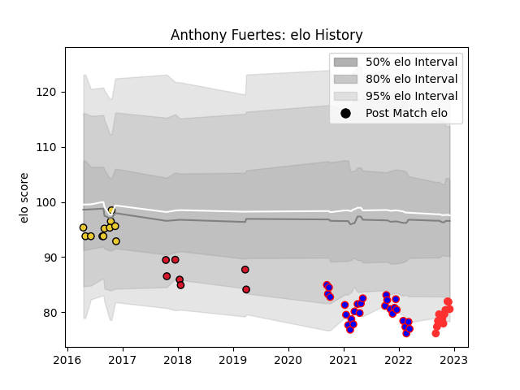

---  
layout: page  
title: Anthony Fuertes  
date: 2022-12-09 13:15:22.534744  
categories: player  
---
# Anthony Fuertes

## Positions: FH

## Current elo: 81.0

## Current Percentile: 8.0

# Elo History

# Match History

| Team        |   Appearances |   Win Rate |
|:------------|--------------:|-----------:|
| Dijon       |            28 |   0.357143 |
| La Rochelle |            11 |   0.636364 |
| Tarbes      |            11 |   0.454545 |
| Oyonnax     |             7 |   0.285714 |

| Opponent                   |   Matches |   Win Rate |
|:---------------------------|----------:|-----------:|
| Cognac Saint Jean d'Angély |         5 |   0.2      |
| Chambery                   |         4 |   0.5      |
| Dax                        |         3 |   0        |
| Tarbes                     |         3 |   0.5      |
| Suresnes                   |         3 |   0.333333 |
| Blagnac                    |         3 |   0.333333 |
| Bourgoin-Jallieu           |         3 |   0.333333 |
| Massy                      |         3 |   0.666667 |
| Connacht                   |         2 |   0        |
| Valence Romans Drome Rugby |         2 |   0.5      |
| Nice                       |         2 |   0.5      |
| Narbonne                   |         2 |   0.5      |
| Aubenas                    |         2 |   0.75     |
| Albi                       |         2 |   0.5      |
| Clermont Auvergne          |         2 |   0.25     |
| Brive                      |         2 |   0        |
| Bordeaux Begles            |         2 |   0.5      |
| Grenoble                   |         1 |   1        |
| Castres Olympique          |         1 |   1        |
| Oyonnax                    |         1 |   0        |
| Rennes                     |         1 |   1        |
| Soyaux-Angouleme           |         1 |   0        |
| Stade Toulousain           |         1 |   1        |
| Biarritz Olympique         |         1 |   0        |
| Benetton Treviso           |         1 |   1        |
| Toulon                     |         1 |   0.5      |
| US Bressane                |         1 |   0        |
| Bayonne                    |         1 |   1        |
| Worcester Warriors         |         1 |   1        |