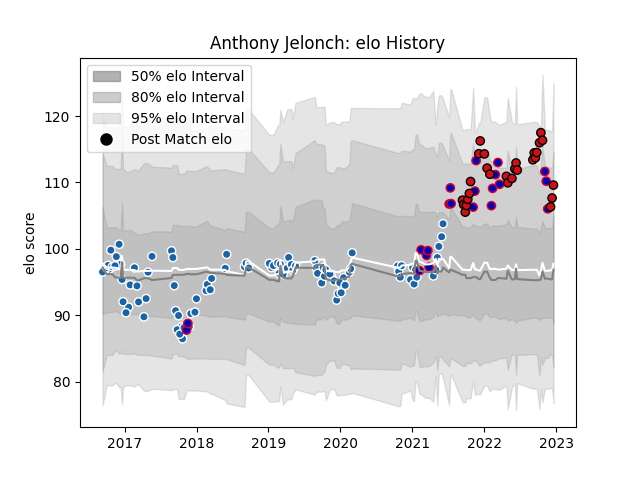

---  
layout: page  
title: Anthony Jelonch  
date: 2022-11-22 11:34:34.522314  
categories: player  
---
# Anthony Jelonch

## Positions: FL, N8

## Country: France

## Current elo: 109.0

## Current Percentile: 92.0

# Elo History

# Match History

| Team              |   Appearances |   Win Rate |
|:------------------|--------------:|-----------:|
| Castres Olympique |            93 |   0.586022 |
| Stade Toulousain  |            25 |   0.68     |
| France            |            21 |   0.714286 |

| Opponent             |   Matches |   Win Rate |
|:---------------------|----------:|-----------:|
| Clermont Auvergne    |        10 |   0.6      |
| Racing 92            |        10 |   0.4      |
| Montpellier Herault  |        10 |   0.6      |
| Lyon                 |        10 |   0.7      |
| Bordeaux Begles      |        10 |   0.6      |
| Toulon               |        10 |   0.5      |
| Brive                |         8 |   0.75     |
| La Rochelle          |         8 |   0.625    |
| Pau                  |         7 |   0.428571 |
| Stade Toulousain     |         6 |   0.583333 |
| Agen                 |         5 |   1        |
| Stade Francais Paris |         5 |   0.6      |
| Australia            |         4 |   0.5      |
| England              |         2 |   0.5      |
| New Zealand          |         2 |   0.5      |
| Biarritz Olympique   |         2 |   1        |
| Leinster             |         2 |   0.25     |
| Scotland             |         2 |   0.5      |
| Dragons              |         2 |   0.5      |
| South Africa         |         2 |   0.5      |
| Italy                |         2 |   1        |
| Ireland              |         2 |   1        |
| Castres Olympique    |         2 |   0.5      |
| Wales                |         2 |   1        |
| Wasps                |         1 |   0        |
| Perpignan            |         1 |   1        |
| RC Enisei            |         1 |   1        |
| Leicester Tigers     |         1 |   0        |
| Northampton Saints   |         1 |   1        |
| Munster              |         1 |   0.5      |
| Argentina            |         1 |   1        |
| Japan                |         1 |   1        |
| Grenoble             |         1 |   1        |
| Georgia              |         1 |   1        |
| Exeter Chiefs        |         1 |   0        |
| Cardiff Blues        |         1 |   1        |
| Bayonne              |         1 |   1        |
| Worcester Warriors   |         1 |   1        |