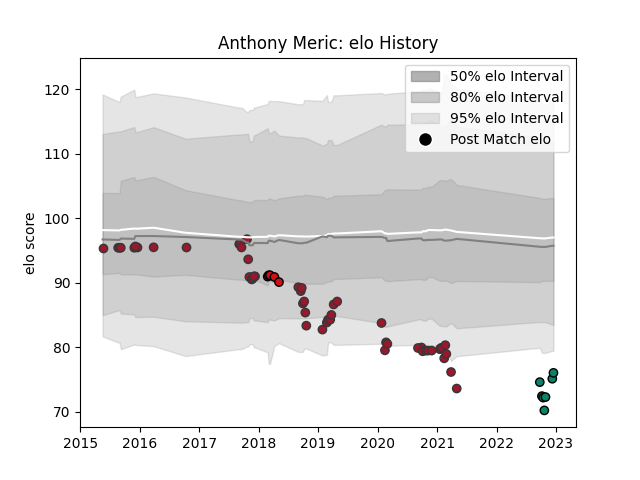

---  
layout: page  
title: Anthony Meric  
date: 2023-01-06 11:43:28.993842  
categories: player  
---
# Anthony Meric

## Positions: SH

## Current elo: 58.0

## Current Percentile: 0.0

# Elo History

# Match History

| Team             |   Appearances |   Win Rate |
|:-----------------|--------------:|-----------:|
| Toulon           |            52 |   0.509615 |
| Montauban        |             8 |   0.25     |
| Stade Toulousain |             5 |   0.4      |

| Opponent             |   Matches |   Win Rate |
|:---------------------|----------:|-----------:|
| Stade Francais Paris |         5 |   0.8      |
| Racing 92            |         5 |   0.4      |
| Lyon                 |         5 |   0.2      |
| Brive                |         5 |   0.8      |
| Clermont Auvergne    |         5 |   0.2      |
| Agen                 |         4 |   0.75     |
| La Rochelle          |         4 |   0.125    |
| Pau                  |         4 |   0.75     |
| Castres Olympique    |         4 |   0.25     |
| Montpellier Herault  |         3 |   0        |
| Stade Toulousain     |         3 |   0.666667 |
| Bordeaux Begles      |         2 |   1        |
| Biarritz Olympique   |         2 |   0        |
| Grenoble             |         1 |   0        |
| Edinburgh            |         1 |   0        |
| Aurillac             |         1 |   0        |
| Leinster             |         1 |   1        |
| Mont-de-Marsan       |         1 |   1        |
| Newcastle Falcons    |         1 |   0        |
| Oyonnax              |         1 |   0        |
| Benetton Treviso     |         1 |   1        |
| Perpignan            |         1 |   1        |
| Provence Rugby       |         1 |   0        |
| Bayonne              |         1 |   0        |
| Soyaux-Angouleme     |         1 |   1        |
| Bath Rugby           |         1 |   1        |
| Leicester Tigers     |         1 |   1        |