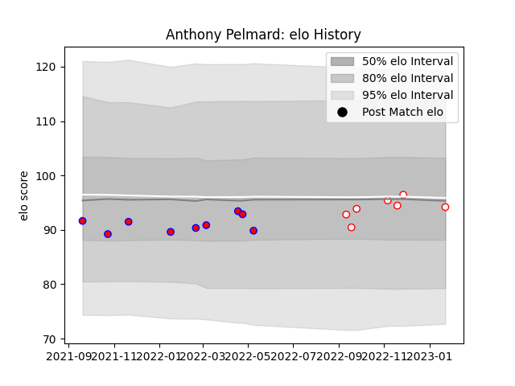

---  
layout: page  
title: Anthony Pelmard  
date: 2023-01-23 15:29:38.622566  
categories: player  
---
# Anthony Pelmard

## Positions: P

## Current elo: 94.0

## Current Percentile: 43.0

# Elo History

# Match History

| Team    |   Appearances |   Win Rate |
|:--------|--------------:|-----------:|
| Blagnac |             9 |   0.333333 |
| Dax     |             7 |   0.857143 |

| Opponent                   |   Matches |   Win Rate |
|:---------------------------|----------:|-----------:|
| Chambery                   |         3 |   1        |
| Valence Romans Drome Rugby |         3 |   0.666667 |
| Bourgoin-Jallieu           |         2 |   0        |
| Nice                       |         2 |   0.5      |
| Carqueiranne-Hyères        |         1 |   1        |
| Cognac Saint Jean d'Angély |         1 |   0        |
| Dijon                      |         1 |   0        |
| Rennes                     |         1 |   1        |
| Soyaux-Angouleme           |         1 |   0        |
| Tarbes                     |         1 |   1        |