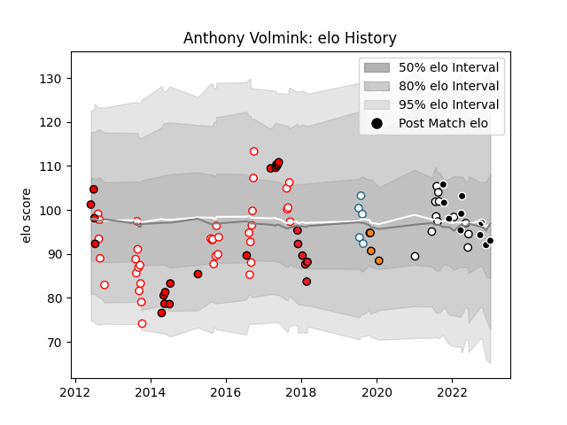

---  
layout: page  
title: Anthony Volmink  
date: 2023-01-13 11:37:39.658096  
categories: player  
---
# Anthony Volmink

## Positions: W, FB

## Current elo: 93.0

## Current Percentile: 42.0

# Elo History

# Match History

| Team           |   Appearances |   Win Rate |
|:---------------|--------------:|-----------:|
| Golden Lions   |            36 |   0.597222 |
| Lions          |            18 |   0.555556 |
| Natal Sharks   |            12 |   0.583333 |
| Sharks         |            10 |   0.6      |
| Southern Kings |             6 |   0.166667 |
| Griquas        |             5 |   0.8      |
| Cheetahs       |             4 |   0.25     |

| Opponent                 |   Matches |   Win Rate |
|:-------------------------|----------:|-----------:|
| Western Province         |        10 |   0.55     |
| Free State Cheetahs      |        10 |   0.5      |
| Griquas                  |         9 |   0.666667 |
| Natal Sharks             |         7 |   0.428571 |
| Blue Bulls               |         7 |   0.714286 |
| Bulls                    |         4 |   0.75     |
| Melbourne Rebels         |         3 |   1        |
| Dragons                  |         3 |   1        |
| Eastern Province Kings   |         3 |   1        |
| Cardiff Blues            |         3 |   0        |
| Golden Lions             |         3 |   0.333333 |
| Pumas                    |         3 |   1        |
| Cheetahs                 |         2 |   0.5      |
| Western Force            |         2 |   0.5      |
| Stormers                 |         2 |   0        |
| Southern Kings           |         2 |   1        |
| Scarlets                 |         2 |   0        |
| Jaguares                 |         2 |   0        |
| Connacht                 |         2 |   0        |
| Edinburgh                |         2 |   0        |
| Brumbies                 |         1 |   1        |
| New South Wales Waratahs |         1 |   0        |
| Ospreys                  |         1 |   1        |
| Leinster                 |         1 |   0        |
| Boland Cavaliers         |         1 |   1        |
| Sharks                   |         1 |   1        |
| Highlanders              |         1 |   0        |
| Glasgow Warriors         |         1 |   1        |
| Ulster                   |         1 |   0        |
| Lions                    |         1 |   1        |