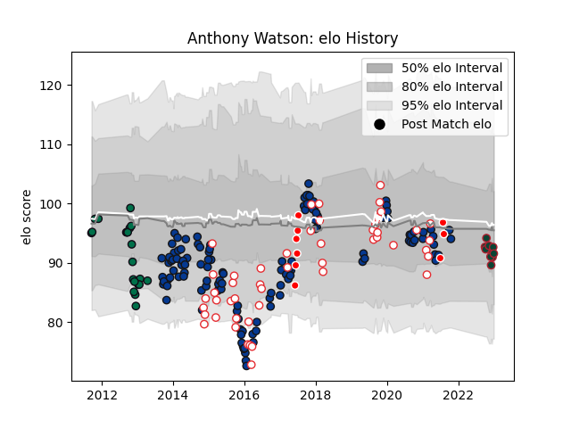

---  
layout: page  
title: Anthony Watson  
date: 2022-12-09 13:05:28.941460  
categories: player  
---
# Anthony Watson

## Positions: FB, W

## Country: British and Irish Lions

## Current elo: 88.0

## Current Percentile: 27.0

# Elo History

# Match History

| Team                    |   Appearances |   Win Rate |
|:------------------------|--------------:|-----------:|
| Bath Rugby              |           122 |   0.569672 |
| England                 |            48 |   0.729167 |
| London Irish            |            21 |   0.52381  |
| British and Irish Lions |             8 |   0.6875   |
| Leicester Tigers        |             6 |   0.416667 |

| Opponent                 |   Matches |   Win Rate |
|:-------------------------|----------:|-----------:|
| Wasps                    |        17 |   0.470588 |
| Leicester Tigers         |        14 |   0.607143 |
| Gloucester Rugby         |        13 |   0.615385 |
| Sale Sharks              |        10 |   0.4      |
| Saracens                 |        10 |   0.25     |
| Exeter Chiefs            |        10 |   0.5      |
| Wales                    |         9 |   0.666667 |
| Harlequins               |         9 |   0.444444 |
| Worcester Warriors       |         8 |   0.875    |
| Northampton Saints       |         8 |   0.3125   |
| Newcastle Falcons        |         7 |   0.714286 |
| London Irish             |         7 |   0.857143 |
| Australia                |         7 |   0.857143 |
| Ireland                  |         6 |   0.333333 |
| Italy                    |         6 |   1        |
| France                   |         5 |   0.8      |
| Scotland                 |         5 |   0.6      |
| New Zealand              |         4 |   0.625    |
| South Africa             |         4 |   0.25     |
| Toulon                   |         4 |   0.25     |
| Bristol Rugby            |         4 |   0.375    |
| Leinster                 |         3 |   0.333333 |
| Bordeaux Begles          |         3 |   1        |
| Stade Toulousain         |         2 |   0.5      |
| Scarlets                 |         2 |   0.5      |
| Argentina                |         2 |   1        |
| Mont-de-Marsan           |         2 |   1        |
| Bath Rugby               |         2 |   0.5      |
| Benetton Treviso         |         2 |   1        |
| London Welsh             |         2 |   0.5      |
| Glasgow Warriors         |         2 |   0.5      |
| Brive                    |         2 |   1        |
| Montpellier Herault      |         2 |   1        |
| Crusaders                |         1 |   1        |
| Uruguay                  |         1 |   1        |
| United States of America |         1 |   1        |
| Tonga                    |         1 |   1        |
| New Zealand Maori        |         1 |   1        |
| Stade Francais Paris     |         1 |   0        |
| Fiji                     |         1 |   1        |
| Samoa                    |         1 |   1        |
| Mogliano                 |         1 |   1        |
| Provincial Union XV      |         1 |   1        |
| Pau                      |         1 |   1        |
| Dragons                  |         1 |   1        |