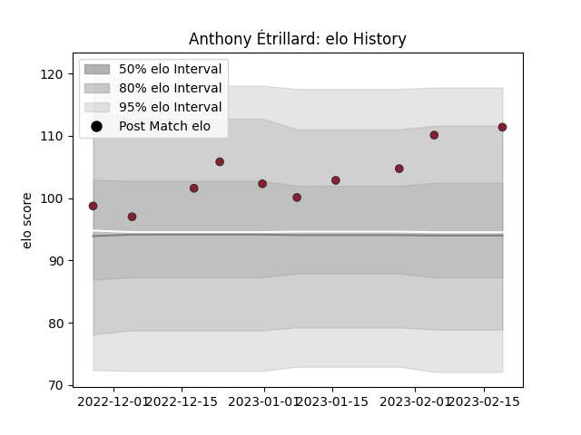

---  
layout: page  
title: Anthony Étrillard  
date: 2023-02-24 02:28:57.502931  
categories: player  
---
# Anthony Étrillard

## Positions: H

## Current elo: 111.0

## Current Percentile: 87.0

# Elo History

# Match History

| Team   |   Appearances |   Win Rate |
|:-------|--------------:|-----------:|
| Toulon |            10 |        0.7 |

| Opponent             |   Matches |   Win Rate |
|:---------------------|----------:|-----------:|
| Bath Rugby           |         2 |          1 |
| Bayonne              |         1 |          0 |
| Brive                |         1 |          0 |
| Lyon                 |         1 |          1 |
| Montpellier Herault  |         1 |          1 |
| Pau                  |         1 |          1 |
| Racing 92            |         1 |          0 |
| Stade Francais Paris |         1 |          1 |
| Stade Toulousain     |         1 |          1 |